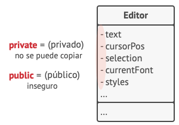

# Patrones de comportamiento

## Chain of Responsibility

### Propósito <a href="#intent" id="intent"></a>

**Chain of Responsibility** es un patrón de diseño de comportamiento que te permite pasar solicitudes a lo largo de una cadena de manejadores. Al recibir una solicitud, cada manejador decide si la procesa o si la pasa al siguiente manejador de la cadena.

<figure><figcaption></figcaption></figure>

### Problema

Imagina que estás trabajando en un sistema de pedidos online. Quieres restringir el acceso al sistema de forma que únicamente los usuarios autenticados puedan generar pedidos. Además, los usuarios que tengan permisos administrativos deben tener pleno acceso a todos los pedidos.

Tras planificar un poco, te das cuenta de que estas comprobaciones deben realizarse secuencialmente. La aplicación puede intentar autenticar a un usuario en el sistema cuando reciba una solicitud que contenga las credenciales del usuario. Sin embargo, si esas credenciales no son correctas y la autenticación falla, no hay razón para proceder con otras comprobaciones.

<figure><figcaption><p>La solicitud debe pasar una serie de comprobaciones antes de que el propio sistema de pedidos pueda gestionarla.</p></figcaption></figure>


Durante los meses siguientes, implementas varias de esas comprobaciones secuenciales.

* Uno de tus colegas sugiere que no es seguro pasar datos sin procesar directamente al sistema de pedidos. De modo que añades un paso adicional de validación para sanear los datos de una solicitud.
* Más tarde, alguien se da cuenta de que el sistema es vulnerable al desciframiento de contraseñas por la fuerza. Para evitarlo, añades rápidamente una comprobación que filtra las solicitudes fallidas repetidas que vengan de la misma dirección IP.
* Otra persona sugiere que podrías acelerar el sistema devolviendo los resultados en caché en solicitudes repetidas que contengan los mismos datos, de modo que añades otra comprobación que permite a la solicitud pasar por el sistema únicamente cuando no hay una respuesta adecuada en caché.

<figure><figcaption><p>Cuanto más crece el código, más se complica.</p></figcaption></figure>

El código de las comprobaciones, que ya se veía desordenado, se vuelve más y más abotargado cada vez que añades una nueva función. En ocasiones, un cambio en una comprobación afecta a las demás. Y lo peor de todo es que, cuando intentas reutilizar las comprobaciones para proteger otros componentes del sistema, tienes que duplicar parte del código, ya que esos componentes necesitan parte de las comprobaciones, pero no todas ellas.

El sistema se vuelve muy difícil de comprender y costoso de mantener. Luchas con el código durante un tiempo hasta que un día decides refactorizarlo todo.

### Solución

Al igual que muchos otros patrones de diseño de comportamiento, el **Chain of Responsibility** se basa en transformar comportamientos particulares en objetos autónomos llamados _manejadores_. En nuestro caso, cada comprobación debe ponerse dentro de su propia clase con un único método que realice la comprobación. La solicitud, junto con su información, se pasa a este método como argumento.

<mark style="background-color:yellow;">El patrón sugiere que vincules esos manejadores en una cadena. Cada manejador vinculado tiene un campo para almacenar una referencia al siguiente manejador de la cadena. Además de procesar una solicitud, los manejadores la pasan a lo largo de la cadena. La solicitud viaja por la cadena hasta que todos los manejadores han tenido la oportunidad de procesarla.</mark>

<mark style="background-color:yellow;">Y ésta es la mejor parte: un manejador puede decidir no pasar la solicitud más allá por la cadena y detener con ello el procesamiento.</mark>

En nuestro ejemplo de los sistemas de pedidos, un manejador realiza el procesamiento y después decide si pasa la solicitud al siguiente eslabón de la cadena. Asumiendo que la solicitud contiene la información correcta, todos los manejadores pueden ejecutar su comportamiento principal, ya sean comprobaciones de autenticación o almacenamiento en la memoria caché.

<figure><figcaption><p>Los manejadores se alinean uno tras otro, formando una cadena.</p></figcaption></figure>

No obstante, hay una solución ligeramente diferente (y un poco más estandarizada) en la que, al recibir una solicitud, un manejador decide si puede procesarla. Si puede, no pasa la solicitud más allá. De modo que un único manejador procesa la solicitud o no lo hace ninguno en absoluto. Esta solución es muy habitual cuando tratamos con eventos en pilas de elementos dentro de una interfaz gráfica de usuario (GUI).

Por ejemplo, cuando un usuario hace clic en un botón, el evento se propaga por la cadena de elementos GUI que comienza en el botón, recorre sus contenedores (como formularios o paneles) y acaba en la ventana principal de la aplicación. El evento es procesado por el primer elemento de la cadena que es capaz de gestionarlo. Este ejemplo también es destacable porque muestra que siempre se puede extraer una cadena de un árbol de objetos.

<figure><figcaption><p>Una cadena puede formarse a partir de una rama de un árbol de objetos.</p></figcaption></figure>

Es fundamental que todas las clases manejadoras implementen la misma interfaz. Cada manejadora concreta solo debe preocuparse por la siguiente que cuente con el método `ejecutar`. De esta forma puedes componer cadenas durante el tiempo de ejecución, utilizando varios manejadores sin acoplar tu código a sus clases concretas.

## **Chain of Responsibility** in Java

### Acceso filtrado <a href="#example-0-title" id="example-0-title"></a>

Este ejemplo muestra cómo una solicitud que contiene información de usuario pasa una cadena secuencial de manejadores que realizan varias acciones, como la autenticación, autorización y validación.

Este ejemplo es un poco diferente de la versión estándar del patrón establecida por varios autores. La mayoría de ejemplos del patrón se basan en la noción de buscar el manejador adecuado, lanzarlo y salir de la cadena a continuación. Pero aquí ejecutamos todos los manejadores hasta que hay uno que **no puede gestionar** una solicitud. Ten en cuenta que éste sigue siendo el patrón Chain of Responsibility, aunque el flujo es un poco distinto.

#### :open\_file\_folder: **middleware**

#### ****:page\_facing\_up: **middleware/Middleware.java (Interfaz de validación básica)**

```java
package chain_of_responsibility.example.middleware;

/**
 * Base middleware class.
 */
public abstract class Middleware {

	private Middleware next;

	/**
	 * Builds chains of middleware objects.
	 */
	public static Middleware link(Middleware first, Middleware... chain) {
		Middleware head = first;
		for (Middleware nextInChain: chain) {
			head.next = nextInChain;
			head = nextInChain;
		}
		return first;
	}

	/**
	 * Subclasses will implement this method with concrete checks.
	 */
	public abstract boolean check(String email, String password);

	/**
	 * Runs check on the next object in chain or ends traversing if we're in
	 * last object in chain.
	 */
	protected boolean checkNext(String email, String password) {
		if (next == null) {
			return true;
		}
		return next.check(email, password);
	}

}
```

#### ****:page\_facing\_up: **middleware/ThrottlingMiddleware.java (**Comprueba el límite de cantidad de solicitudes**)**

```java
package chain_of_responsibility.example.middleware;

/**
 * ConcreteHandler. Checks whether there are too many failed login requests.
 */
public class ThrottlingMiddleware extends Middleware {

	private int requestPerMinute;
	private int request;
	private long currentTime;

	public ThrottlingMiddleware(int requestPerMinute) {
		this.requestPerMinute = requestPerMinute;
		this.currentTime = System.currentTimeMillis();
	}

	/**
	 * Please, not that checkNext() call can be inserted both in the beginning
	 * of this method and in the end.
	 *
	 * This gives much more flexibility than a simple loop over all middleware
	 * objects. For instance, an element of a chain can change the order of
	 * checks by running its check after all other checks.
	 */
	public boolean check(String email, String password) {
		if (System.currentTimeMillis() > currentTime + 60_000) {
			request = 0;
			currentTime = System.currentTimeMillis();
		}

		request++;

		if (request > requestPerMinute) {
			System.out.println("Request limit exceeded!");
			Thread.currentThread().stop();
		}
		return checkNext(email, password);
	}

}
```

#### :page\_facing\_up: **middleware/UserExistsMiddleware.java **<mark style="color:green;">****</mark>** (**Comprueba las credenciales del usuario)

```java
package chain_of_responsibility.example.middleware;

import chain_of_responsibility.example.server.Server;

/**
 * ConcreteHandler. Checks whether a user with the given credentials exists.
 */
public class UserExistsMiddleware extends Middleware {

	private Server server;

	public UserExistsMiddleware(Server server) {
		this.server = server;
	}

	public boolean check(String email, String password) {
		if (!server.hasEmail(email)) {
			System.out.println("This email is not registered!");
			return false;
		}
		if (!server.isValidPassword(email, password)) {
			System.out.println("Wrong password!");
			return false;
		}
		return checkNext(email, password);
	}

}
```

#### :page\_facing\_up: middleware/RoleCheckMiddleware.java (Comprueba el papel del usuario)

```java
package chain_of_responsibility.example.middleware;

/**
 * ConcreteHandler. Checks a user's role.
 */
public class RoleCheckMiddleware extends Middleware {
	
	public boolean check(String email, String password) {
        if (email.equals("admin@example.com")) {
            System.out.println("Hello, admin!");
            return true;
        }
        System.out.println("Hello, user!");
        return checkNext(email, password);
    }

}
```

#### :open\_file\_folder: **server**

#### :page\_facing\_up: server/Server.java (Objetivo de la autorización)

```java
package chain_of_responsibility.example.server;

import java.util.HashMap;
import java.util.Map;

import chain_of_responsibility.example.middleware.Middleware;

/**
 * Server class.
 */
public class Server {

	private Map<String, String> users = new HashMap<>();
	private Middleware middleware;

	/**
	 * Client passes a chain of object to server. This improves flexibility and
	 * makes testing the server class easier.
	 */
	public void setMiddleware(Middleware middleware) {
		this.middleware = middleware;
	}

	/**
	 * Server gets email and password from client and sends the authorization
	 * request to the chain.
	 */
	public boolean logIn(String email, String password) {
		if (middleware.check(email, password)) {
			System.out.println("Authorization have been successful!");

			// Do something useful here for authorized users.

			return true;
		}
		return false;
	}

	public void register(String email, String password) {
		users.put(email, password);
	}

	public boolean hasEmail(String email) {
		return users.containsKey(email);
	}

	public boolean isValidPassword(String email, String password) {
		return users.get(email).equals(password);
	}

}
```

#### :page\_facing\_up: Demo.java

```java
package chain_of_responsibility.example;

import java.io.BufferedReader;
import java.io.IOException;
import java.io.InputStreamReader;

import chain_of_responsibility.example.middleware.Middleware;
import chain_of_responsibility.example.middleware.RoleCheckMiddleware;
import chain_of_responsibility.example.middleware.ThrottlingMiddleware;
import chain_of_responsibility.example.middleware.UserExistsMiddleware;
import chain_of_responsibility.example.server.Server;

/**
 * Demo class. Everything comes together here.
 */
public class Demo {

	private static BufferedReader reader = new BufferedReader(new InputStreamReader(System.in));
	private static Server server;

	private static void init() {
		server = new Server();
		server.register("admin@example.com", "admin_pass");
		server.register("user@example.com", "user_pass");

		// All checks are linked. Client can build various chains using the same
		// components.
		Middleware middleware = Middleware.link(
				new ThrottlingMiddleware(2),
				new UserExistsMiddleware(server),
				new RoleCheckMiddleware()
				);

		// Server gets a chain from client code.
		server.setMiddleware(middleware);
	}

	public static void main(String[] args) throws IOException {

		init();

		boolean success;
		do {
			System.out.print("Enter email: ");
			String email = reader.readLine();
			System.out.print("Input password: ");
			String password = reader.readLine();
			success = server.logIn(email, password);
		} while (!success);
	}

}
```

## Command

### Propósito

<mark style="background-color:yellow;">**Command**</mark> <mark style="background-color:yellow;"></mark><mark style="background-color:yellow;">es un patrón de diseño de comportamiento que convierte una solicitud en un objeto independiente que contiene toda la información sobre la solicitud.</mark> Esta transformación te permite parametrizar los métodos con diferentes solicitudes, retrasar o poner en cola la ejecución de una solicitud y soportar operaciones que no se pueden realizar.

<figure><figcaption></figcaption></figure>

### Problema <a href="#problem" id="problem"></a>

Imagina que estás trabajando en una nueva aplicación de edición de texto. Tu tarea actual consiste en crear una barra de herramientas con unos cuantos botones para varias operaciones del editor. Creaste una clase `Botón` muy limpia que puede utilizarse para los botones de la barra de herramientas y también para botones genéricos en diversos diálogos.

<figure><figcaption><p>Todos los botones de la aplicación provienen de la misma clase.</p></figcaption></figure>

Aunque todos estos botones se parecen, se supone que hacen cosas diferentes. ¿Dónde pondrías el código para los varios gestores de clics de estos botones? La solución más simple consiste en crear cientos de subclases para cada lugar donde se utilice el botón. Estas subclases contendrán el código que deberá ejecutarse con el clic en un botón.

<figure><figcaption><p>Muchas subclases de botón. ¿Qué puede salir mal?</p></figcaption></figure>

Pronto te das cuenta de que esta solución es muy deficiente. En primer lugar, tienes una enorme cantidad de subclases, lo cual no supondría un problema si no corrieras el riesgo de descomponer el código de esas subclases cada vez que modifiques la clase base `Botón`. Dicho de forma sencilla, tu código GUI depende torpemente del volátil código de la lógica de negocio.

<figure><figcaption><p>Varias clases implementan la misma funcionalidad.</p></figcaption></figure>

Y aquí está la parte más desagradable. Algunas operaciones, como copiar/pegar texto, deben ser invocadas desde varios lugares. Por ejemplo, un usuario podría hacer clic en un pequeño botón “Copiar” de la barra de herramientas, o copiar algo a través del menú contextual, o pulsar `Ctrl+C` en el teclado.

Inicialmente, cuando tu aplicación solo tenía la barra de herramientas, no había problema en colocar la implementación de varias operaciones dentro de las subclases de botón. En otras palabras, tener el código para copiar texto dentro de la subclase `BotónCopiar` estaba bien. Sin embargo, cuando implementas menús contextuales, atajos y otros elementos, debes duplicar el código de la operación en muchas clases, o bien hacer menús dependientes de los botones, lo cual es una opción aún peor.

### Solución

El buen diseño de software a menudo se basa en el principio de separación de responsabilidades, lo que suele tener como resultado la división de la aplicación en capas. El ejemplo más habitual es tener una capa para la interfaz gráfica de usuario (GUI) y otra capa para la lógica de negocio. La capa GUI es responsable de representar una bonita imagen en pantalla, capturar entradas y mostrar resultados de lo que el usuario y la aplicación están haciendo. Sin embargo, cuando se trata de hacer algo importante, como calcular la trayectoria de la luna o componer un informe anual, la capa GUI delega el trabajo a la capa subyacente de la lógica de negocio.

El código puede tener este aspecto: un objeto GUI invoca a un método de un objeto de la lógica de negocio, pasándole algunos argumentos. Este proceso se describe habitualmente como un objeto que envía a otro una _solicitud_.

<figure><figcaption><p>Los objetos GUI pueden acceder directamente a los objetos de la lógica de negocio.</p></figcaption></figure>

<mark style="background-color:yellow;">El patrón Command sugiere que los objetos GUI no envíen estas solicitudes directamente. En lugar de ello, debes extraer todos los detalles de la solicitud, como el objeto que está siendo invocado, el nombre del método y la lista de argumentos, y ponerlos dentro de una clase</mark> <mark style="background-color:yellow;"></mark>_<mark style="background-color:yellow;">comando</mark>_ <mark style="background-color:yellow;"></mark><mark style="background-color:yellow;">separada con un único método que activa esta solicitud.</mark>

Los objetos de comando sirven como vínculo entre varios objetos GUI y de lógica de negocio. De ahora en adelante, el objeto GUI no tiene que conocer qué objeto de la lógica de negocio recibirá la solicitud y cómo la procesará. El objeto GUI activa el comando, que gestiona todos los detalles.

<figure><figcaption><p>Acceso a la capa de lógica de negocio a través de un comando.</p></figcaption></figure>

El siguiente paso es hacer que tus comandos implementen la misma interfaz. Normalmente tiene un único método de ejecución que no acepta parámetros. Esta interfaz te permite utilizar varios comandos con el mismo emisor de la solicitud, sin acoplarla a clases concretas de comandos. Adicionalmente, ahora puedes cambiar objetos de comando vinculados al emisor, cambiando efectivamente el comportamiento del emisor durante el tiempo de ejecución.

Puede que hayas observado que falta una pieza del rompecabezas, que son los parámetros de la solicitud. Un objeto GUI puede haber proporcionado al objeto de la capa de negocio algunos parámetros. Ya que el método de ejecución del comando no tiene parámetros, ¿cómo pasaremos los detalles de la solicitud al receptor? <mark style="background-color:yellow;">Resulta que el comando debe estar preconfigurado con esta información o ser capaz de conseguirla por su cuenta.mage</mark>

<figure><figcaption><p>Los objetos GUI delegan el trabajo a los comandos.</p></figcaption></figure>

Regresemos a nuestro editor de textos. Tras aplicar el patrón Command, ya no necesitamos todas esas subclases de botón para implementar varios comportamientos de clic. Basta con colocar un único campo dentro de la clase base `Botón` que almacene una referencia a un objeto de comando y haga que el botón ejecute ese comando en un clic.

Implementarás un puñado de clases de comando para toda operación posible y las vincularás con botones particulares, dependiendo del comportamiento pretendido de los botones.

Otros elementos GUI, como menús, atajos o diálogos enteros, se pueden implementar del mismo modo. Se vincularán a un comando que se ejecuta cuando un usuario interactúa con el elemento GUI. Como probablemente ya habrás adivinado, los elementos relacionados con las mismas operaciones se vincularán a los mismos comandos, evitando cualquier duplicación de código.

<mark style="background-color:yellow;">Como resultado, los comandos se convierten en una conveniente capa intermedia que reduce el acoplamiento entre las capas de la GUI y la lógica de negocio.</mark> ¡Y esto es tan solo una fracción de las ventajas que ofrece el patrón Command!

## **Command** in Java

### Comandos de editor de texto y deshacer <a href="#example-0-title" id="example-0-title"></a>

El editor de texto de este ejemplo crea nuevos objetos de comando cada vez que un usuario interactúa con él. Tras ejecutar sus acciones, un comando es empujado a la pila del historial.

Ahora, para realizar la operación deshacer (undo), la aplicación toma el último comando ejecutado del historial y, o bien realiza una acción inversa, o bien restaura el pasado estado del editor guardado por ese comando.

#### :open\_file\_folder: **commands**

#### :page\_facing\_up: **commands/Command.java (Comando base abstracto)**

```java
package command.example.commands;

import command.example.editor.Editor;

public abstract class Command {

	public Editor editor;
	private String backup;

	Command(Editor editor) {
		this.editor = editor;
	}

	void backup() {
		backup = editor.textField.getText();
	}

	public void undo() {
		editor.textField.setText(backup);
	}

	public abstract boolean execute();

}
```

#### :page\_facing\_up: **commands/CopyCommand.java (Copiar el texto seleccionado en el portapapeles)**

```java
package command.example.commands;

import command.example.editor.Editor;

public class CopyCommand extends Command {

	public CopyCommand(Editor editor) {
		super(editor);
	}

	@Override
	public boolean execute() {
		editor.clipboard = editor.textField.getSelectedText();
		return false;
	}

}
```

#### :page\_facing\_up: **commands/PasteCommand.java (Pegar texto desde el portapapeles)**

```java
package command.example.commands;

import command.example.editor.Editor;

public class PasteCommand extends Command {

	public PasteCommand(Editor editor) {
		super(editor);
	}

	@Override
	public boolean execute() {
		if (editor.clipboard == null || editor.clipboard.isEmpty()) return false;

		backup();
		editor.textField.insert(editor.clipboard, editor.textField.getCaretPosition());
		return true;
	}

}
```

#### :page\_facing\_up: **commands/CutCommand.java (Cortar texto al portapapeles)**

```java
package command.example.commands;

import command.example.editor.Editor;

public class CutCommand extends Command {

	public CutCommand(Editor editor) {
		super(editor);
	}

	@Override
	public boolean execute() {
		if (editor.textField.getSelectedText().isEmpty()) return false;

		backup();
		String source = editor.textField.getText();
		editor.clipboard = editor.textField.getSelectedText();
		editor.textField.setText(cutString(source));
		return true;
	}

	private String cutString(String source) {
		String start = source.substring(0, editor.textField.getSelectionStart());
		String end = source.substring(editor.textField.getSelectionEnd());
		return start + end;
	}

}
```

#### :page\_facing\_up: **commands/CommandHistory.java (Historial del comando)**

```java
package command.example.commands;

import java.util.Stack;

public class CommandHistory {

	private Stack<Command> history = new Stack<>();

	public void push(Command c) {
		history.push(c);
	}

	public Command pop() {
		return history.pop();
	}

	public boolean isEmpty() { return history.isEmpty(); }

}
```

#### :open\_file\_folder: **editor**

#### :page\_facing\_up: **editor/Editor.java (Historial del comando)**

```java
package command.example.editor;

import java.awt.FlowLayout;
import java.awt.event.ActionEvent;
import java.awt.event.ActionListener;

import javax.swing.BoxLayout;
import javax.swing.JButton;
import javax.swing.JFrame;
import javax.swing.JPanel;		
import javax.swing.JTextArea;
import javax.swing.WindowConstants;

import command.example.commands.Command;
import command.example.commands.CommandHistory;
import command.example.commands.CopyCommand;
import command.example.commands.CutCommand;
import command.example.commands.PasteCommand;

public class Editor {

	public JTextArea textField;
	public String clipboard;
	private CommandHistory history = new CommandHistory();

	public void init() {
		JFrame frame = new JFrame("Text editor (type & use buttons, Luke!)");
		JPanel content = new JPanel();
		frame.setContentPane(content);
		frame.setDefaultCloseOperation(WindowConstants.EXIT_ON_CLOSE);
		content.setLayout(new BoxLayout(content, BoxLayout.Y_AXIS));
		textField = new JTextArea();
		textField.setLineWrap(true);
		content.add(textField);
		JPanel buttons = new JPanel(new FlowLayout(FlowLayout.CENTER));
		JButton ctrlC = new JButton("Ctrl+C");
		JButton ctrlX = new JButton("Ctrl+X");
		JButton ctrlV = new JButton("Ctrl+V");
		JButton ctrlZ = new JButton("Ctrl+Z");
		Editor editor = this;
		ctrlC.addActionListener(new ActionListener() {
			@Override
			public void actionPerformed(ActionEvent e) {
				executeCommand(new CopyCommand(editor));
			}
		});
		ctrlX.addActionListener(new ActionListener() {
			@Override
			public void actionPerformed(ActionEvent e) {
				executeCommand(new CutCommand(editor));
			}
		});
		ctrlV.addActionListener(new ActionListener() {
			@Override
			public void actionPerformed(ActionEvent e) {
				executeCommand(new PasteCommand(editor));
			}
		});
		ctrlZ.addActionListener(new ActionListener() {
			@Override
			public void actionPerformed(ActionEvent e) {
				undo();
			}
		});
		buttons.add(ctrlC);
		buttons.add(ctrlX);
		buttons.add(ctrlV);
		buttons.add(ctrlZ);
		content.add(buttons);
		frame.setSize(450, 200);
		frame.setLocationRelativeTo(null);
		frame.setVisible(true);
	}

	private void executeCommand(Command command) {
		if (command.execute()) {
			history.push(command);
		}
	}

	private void undo() {
		if (history.isEmpty()) return;

		Command command = history.pop();
		if (command != null) {
			command.undo();
		}
	}
}
```

#### :page\_facing\_up: Demo.java

```java
package command.example;

import command.example.editor.Editor;

public class Demo {

	public static void main(String[] args) {
		Editor editor = new Editor();
		editor.init();
	}

}
```
