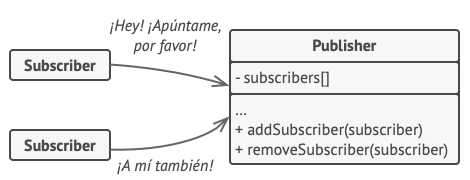
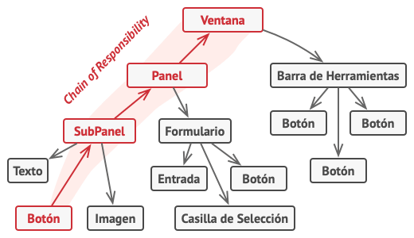
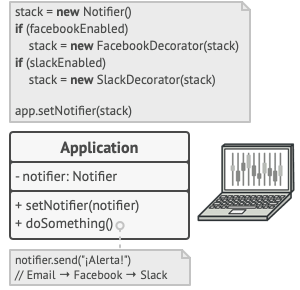
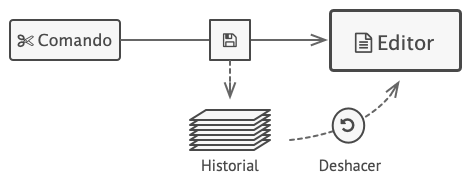
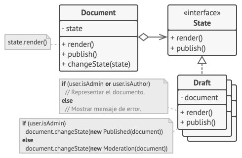
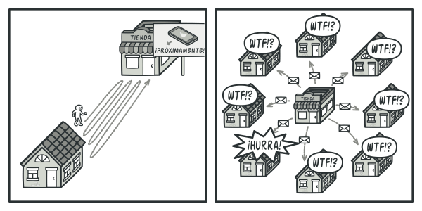
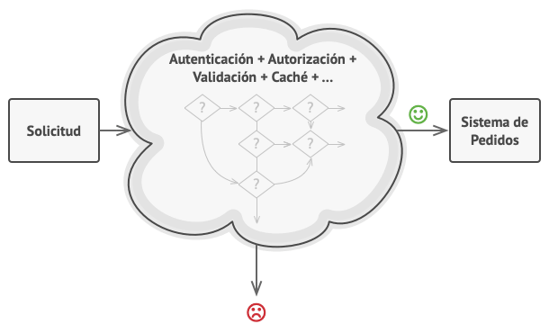

# Patrones de comportamiento

Los patrones de comportamiento tratan con algoritmos y la asignación de responsabilidades entre objetos.

## Chain of Responsibility

### Propósito <a href="#intent" id="intent"></a>

**Chain of Responsibility** es un patrón de diseño de comportamiento que te permite pasar solicitudes a lo largo de una cadena de manejadores. Al recibir una solicitud, cada manejador decide si la procesa o si la pasa al siguiente manejador de la cadena.

<figure><figcaption></figcaption></figure>

### Problema

Imagina que estás trabajando en un sistema de pedidos online. Quieres restringir el acceso al sistema de forma que únicamente los usuarios autenticados puedan generar pedidos. Además, los usuarios que tengan permisos administrativos deben tener pleno acceso a todos los pedidos.

Tras planificar un poco, te das cuenta de que estas comprobaciones deben realizarse secuencialmente. La aplicación puede intentar autenticar a un usuario en el sistema cuando reciba una solicitud que contenga las credenciales del usuario. Sin embargo, si esas credenciales no son correctas y la autenticación falla, no hay razón para proceder con otras comprobaciones.

<figure><figcaption><p>La solicitud debe pasar una serie de comprobaciones antes de que el propio sistema de pedidos pueda gestionarla.</p></figcaption></figure>

Durante los meses siguientes, implementas varias de esas comprobaciones secuenciales.

* Uno de tus colegas sugiere que no es seguro pasar datos sin procesar directamente al sistema de pedidos. De modo que añades un paso adicional de validación para sanear los datos de una solicitud.
* Más tarde, alguien se da cuenta de que el sistema es vulnerable al desciframiento de contraseñas por la fuerza. Para evitarlo, añades rápidamente una comprobación que filtra las solicitudes fallidas repetidas que vengan de la misma dirección IP.
* Otra persona sugiere que podrías acelerar el sistema devolviendo los resultados en caché en solicitudes repetidas que contengan los mismos datos, de modo que añades otra comprobación que permite a la solicitud pasar por el sistema únicamente cuando no hay una respuesta adecuada en caché.

<figure><figcaption><p>Cuanto más crece el código, más se complica.</p></figcaption></figure>

El código de las comprobaciones, que ya se veía desordenado, se vuelve más y más abotargado cada vez que añades una nueva función. En ocasiones, un cambio en una comprobación afecta a las demás. Y lo peor de todo es que, cuando intentas reutilizar las comprobaciones para proteger otros componentes del sistema, tienes que duplicar parte del código, ya que esos componentes necesitan parte de las comprobaciones, pero no todas ellas.

El sistema se vuelve muy difícil de comprender y costoso de mantener. Luchas con el código durante un tiempo hasta que un día decides refactorizarlo todo.

### Solución

Al igual que muchos otros patrones de diseño de comportamiento, el **Chain of Responsibility** se basa en transformar comportamientos particulares en objetos autónomos llamados _manejadores_. En nuestro caso, cada comprobación debe ponerse dentro de su propia clase con un único método que realice la comprobación. La solicitud, junto con su información, se pasa a este método como argumento.

<mark style="background-color:yellow;">El patrón sugiere que vincules esos manejadores en una cadena. Cada manejador vinculado tiene un campo para almacenar una referencia al siguiente manejador de la cadena. Además de procesar una solicitud, los manejadores la pasan a lo largo de la cadena. La solicitud viaja por la cadena hasta que todos los manejadores han tenido la oportunidad de procesarla.</mark>

<mark style="background-color:yellow;">Y ésta es la mejor parte: un manejador puede decidir no pasar la solicitud más allá por la cadena y detener con ello el procesamiento.</mark>

En nuestro ejemplo de los sistemas de pedidos, un manejador realiza el procesamiento y después decide si pasa la solicitud al siguiente eslabón de la cadena. Asumiendo que la solicitud contiene la información correcta, todos los manejadores pueden ejecutar su comportamiento principal, ya sean comprobaciones de autenticación o almacenamiento en la memoria caché.

<figure><figcaption><p>Los manejadores se alinean uno tras otro, formando una cadena.</p></figcaption></figure>

No obstante, hay una solución ligeramente diferente (y un poco más estandarizada) en la que, al recibir una solicitud, un manejador decide si puede procesarla. Si puede, no pasa la solicitud más allá. De modo que un único manejador procesa la solicitud o no lo hace ninguno en absoluto. Esta solución es muy habitual cuando tratamos con eventos en pilas de elementos dentro de una interfaz gráfica de usuario (GUI).

Por ejemplo, cuando un usuario hace clic en un botón, el evento se propaga por la cadena de elementos GUI que comienza en el botón, recorre sus contenedores (como formularios o paneles) y acaba en la ventana principal de la aplicación. El evento es procesado por el primer elemento de la cadena que es capaz de gestionarlo. Este ejemplo también es destacable porque muestra que siempre se puede extraer una cadena de un árbol de objetos.

<figure><figcaption><p>Una cadena puede formarse a partir de una rama de un árbol de objetos.</p></figcaption></figure>

Es fundamental que todas las clases manejadoras implementen la misma interfaz. Cada manejadora concreta solo debe preocuparse por la siguiente que cuente con el método `ejecutar`. De esta forma puedes componer cadenas durante el tiempo de ejecución, utilizando varios manejadores sin acoplar tu código a sus clases concretas.

### Pros y contras <a href="#pros-cons" id="pros-cons"></a>

:heavy\_check\_mark:  Puedes controlar el orden de control de solicitudes.

:heavy\_check\_mark:  _Principio de responsabilidad única_. Puedes desacoplar las clases que invoquen operaciones de las que realicen operaciones.

:heavy\_check\_mark:  _Principio de abierto/cerrado_. Puedes introducir nuevos manejadores en la aplicación sin descomponer el código cliente existente.

:heavy\_multiplication\_x:  Algunas solicitudes pueden acabar sin ser gestionadas.

## Chain of Responsibility in Java

### Acceso filtrado <a href="#example-0-title" id="example-0-title"></a>

Este ejemplo muestra cómo una solicitud que contiene información de usuario pasa una cadena secuencial de manejadores que realizan varias acciones, como la autenticación, autorización y validación.

Este ejemplo es un poco diferente de la versión estándar del patrón establecida por varios autores. La mayoría de ejemplos del patrón se basan en la noción de buscar el manejador adecuado, lanzarlo y salir de la cadena a continuación. Pero aquí ejecutamos todos los manejadores hasta que hay uno que **no puede gestionar** una solicitud. Ten en cuenta que éste sigue siendo el patrón Chain of Responsibility, aunque el flujo es un poco distinto.

```
chain_of_responsibility
├── middleware
│   ├── Middleware.java (Interfaz de validación básica)
│   ├── ThrottlingMiddleware.java (Comprueba el límite de cantidad de solicitudes)
│   ├── UserExistsMiddleware.java (Comprueba las credenciales del usuario)
│   └── UserExistsMiddleware.java (Comprueba el papel del usuario)
├── server
│   └── Server.java (Objetivo de la autorización)
└── Demo.java (Código cliente)
```

:link: [Chain of Responsibility in Java](https://github.com/dromero-7854/knowledge/tree/main/java-design-patterns-examples/src/chain\_of\_responsibility/example)

## Command

### Propósito

<mark style="background-color:yellow;">**Command**</mark> <mark style="background-color:yellow;">es un patrón de diseño de comportamiento que convierte una solicitud en un objeto independiente que contiene toda la información sobre la solicitud.</mark> Esta transformación te permite parametrizar los métodos con diferentes solicitudes, retrasar o poner en cola la ejecución de una solicitud y soportar operaciones que no se pueden realizar.

<figure><figcaption></figcaption></figure>

### Problema <a href="#problem" id="problem"></a>

Imagina que estás trabajando en una nueva aplicación de edición de texto. Tu tarea actual consiste en crear una barra de herramientas con unos cuantos botones para varias operaciones del editor. Creaste una clase `Botón` muy limpia que puede utilizarse para los botones de la barra de herramientas y también para botones genéricos en diversos diálogos.

<figure><figcaption><p>Todos los botones de la aplicación provienen de la misma clase.</p></figcaption></figure>

Aunque todos estos botones se parecen, se supone que hacen cosas diferentes. ¿Dónde pondrías el código para los varios gestores de clics de estos botones? La solución más simple consiste en crear cientos de subclases para cada lugar donde se utilice el botón. Estas subclases contendrán el código que deberá ejecutarse con el clic en un botón.

<figure><figcaption><p>Muchas subclases de botón. ¿Qué puede salir mal?</p></figcaption></figure>

Pronto te das cuenta de que esta solución es muy deficiente. En primer lugar, tienes una enorme cantidad de subclases, lo cual no supondría un problema si no corrieras el riesgo de descomponer el código de esas subclases cada vez que modifiques la clase base `Botón`. Dicho de forma sencilla, tu código GUI depende torpemente del volátil código de la lógica de negocio.

<figure><figcaption><p>Varias clases implementan la misma funcionalidad.</p></figcaption></figure>

Y aquí está la parte más desagradable. Algunas operaciones, como copiar/pegar texto, deben ser invocadas desde varios lugares. Por ejemplo, un usuario podría hacer clic en un pequeño botón “Copiar” de la barra de herramientas, o copiar algo a través del menú contextual, o pulsar `Ctrl+C` en el teclado.

Inicialmente, cuando tu aplicación solo tenía la barra de herramientas, no había problema en colocar la implementación de varias operaciones dentro de las subclases de botón. En otras palabras, tener el código para copiar texto dentro de la subclase `BotónCopiar` estaba bien. Sin embargo, cuando implementas menús contextuales, atajos y otros elementos, debes duplicar el código de la operación en muchas clases, o bien hacer menús dependientes de los botones, lo cual es una opción aún peor.

### Solución

El buen diseño de software a menudo se basa en el principio de separación de responsabilidades, lo que suele tener como resultado la división de la aplicación en capas. El ejemplo más habitual es tener una capa para la interfaz gráfica de usuario (GUI) y otra capa para la lógica de negocio. La capa GUI es responsable de representar una bonita imagen en pantalla, capturar entradas y mostrar resultados de lo que el usuario y la aplicación están haciendo. Sin embargo, cuando se trata de hacer algo importante, como calcular la trayectoria de la luna o componer un informe anual, la capa GUI delega el trabajo a la capa subyacente de la lógica de negocio.

El código puede tener este aspecto: un objeto GUI invoca a un método de un objeto de la lógica de negocio, pasándole algunos argumentos. Este proceso se describe habitualmente como un objeto que envía a otro una _solicitud_.

<figure><figcaption><p>Los objetos GUI pueden acceder directamente a los objetos de la lógica de negocio.</p></figcaption></figure>

<mark style="background-color:yellow;">El patrón Command sugiere que los objetos GUI no envíen estas solicitudes directamente. En lugar de ello, debes extraer todos los detalles de la solicitud, como el objeto que está siendo invocado, el nombre del método y la lista de argumentos, y ponerlos dentro de una clase</mark> _<mark style="background-color:yellow;">comando</mark>_ <mark style="background-color:yellow;">separada con un único método que activa esta solicitud.</mark>

Los objetos de comando sirven como vínculo entre varios objetos GUI y de lógica de negocio. De ahora en adelante, el objeto GUI no tiene que conocer qué objeto de la lógica de negocio recibirá la solicitud y cómo la procesará. El objeto GUI activa el comando, que gestiona todos los detalles.

<figure><figcaption><p>Acceso a la capa de lógica de negocio a través de un comando.</p></figcaption></figure>

El siguiente paso es hacer que tus comandos implementen la misma interfaz. Normalmente tiene un único método de ejecución que no acepta parámetros. Esta interfaz te permite utilizar varios comandos con el mismo emisor de la solicitud, sin acoplarla a clases concretas de comandos. Adicionalmente, ahora puedes cambiar objetos de comando vinculados al emisor, cambiando efectivamente el comportamiento del emisor durante el tiempo de ejecución.

Puede que hayas observado que falta una pieza del rompecabezas, que son los parámetros de la solicitud. Un objeto GUI puede haber proporcionado al objeto de la capa de negocio algunos parámetros. Ya que el método de ejecución del comando no tiene parámetros, ¿cómo pasaremos los detalles de la solicitud al receptor? <mark style="background-color:yellow;">Resulta que el comando debe estar preconfigurado con esta información o ser capaz de conseguirla por su cuenta.</mark>

<figure><figcaption><p>Los objetos GUI delegan el trabajo a los comandos.</p></figcaption></figure>

Regresemos a nuestro editor de textos. Tras aplicar el patrón Command, ya no necesitamos todas esas subclases de botón para implementar varios comportamientos de clic. Basta con colocar un único campo dentro de la clase base `Botón` que almacene una referencia a un objeto de comando y haga que el botón ejecute ese comando en un clic.

Implementarás un puñado de clases de comando para toda operación posible y las vincularás con botones particulares, dependiendo del comportamiento pretendido de los botones.

Otros elementos GUI, como menús, atajos o diálogos enteros, se pueden implementar del mismo modo. Se vincularán a un comando que se ejecuta cuando un usuario interactúa con el elemento GUI. Como probablemente ya habrás adivinado, los elementos relacionados con las mismas operaciones se vincularán a los mismos comandos, evitando cualquier duplicación de código.

<mark style="background-color:yellow;">Como resultado, los comandos se convierten en una conveniente capa intermedia que reduce el acoplamiento entre las capas de la GUI y la lógica de negocio.</mark> ¡Y esto es tan solo una fracción de las ventajas que ofrece el patrón Command!

### Pros y contras <a href="#pros-cons" id="pros-cons"></a>

:heavy\_check\_mark:  _Principio de responsabilidad única_. Puedes desacoplar las clases que invocan operaciones de las que realizan esas operaciones.

:heavy\_check\_mark:  _Principio de abierto/cerrado_. Puedes introducir nuevos comandos en la aplicación sin descomponer el código cliente existente.

:heavy\_check\_mark:  Puedes implementar deshacer/rehacer.

:heavy\_check\_mark:  Puedes implementar la ejecución diferida de operaciones.

:heavy\_check\_mark:  Puedes ensamblar un grupo de comandos simples para crear uno complejo.

:heavy\_multiplication\_x:  El código puede complicarse, ya que estás introduciendo una nueva capa entre emisores y receptores.

## Command in Java

### Comandos de editor de texto y deshacer <a href="#example-0-title" id="example-0-title"></a>

El editor de texto de este ejemplo crea nuevos objetos de comando cada vez que un usuario interactúa con él. Tras ejecutar sus acciones, un comando es empujado a la pila del historial.

Ahora, para realizar la operación deshacer (undo), la aplicación toma el último comando ejecutado del historial y, o bien realiza una acción inversa, o bien restaura el pasado estado del editor guardado por ese comando.

```
command
├── commands
│   ├── Command.java (Comando base abstracto)
│   ├── CopyCommand.java (Copiar el texto seleccionado en el portapapeles)
│   ├── PasteCommand.java (Pegar texto desde el portapapeles)
│   ├── CutCommand.java (Cortar texto al portapapeles)
│   └── CommandHistory.java (Historial del comando)
├── editor
│   └── Editor.java (GUI del editor de texto)
└── Demo.java (Código cliente)
```

:link: [Command in Java](https://github.com/dromero-7854/knowledge/tree/main/java-design-patterns-examples/src/command/example)

## Iterator

### Propósito

**Iterator** es un patrón de diseño de comportamiento que te permite recorrer elementos de una colección sin exponer su representación subyacente (lista, pila, árbol, etc.)

<figure><figcaption></figcaption></figure>

### Problema

Las colecciones son de los tipos de datos más utilizados en programación. Sin embargo, una colección tan solo es un contenedor para un grupo de objetos.

<figure><figcaption><p>Varios tipos de colecciones.</p></figcaption></figure>

La mayoría de las colecciones almacena sus elementos en simples listas, pero algunas de ellas se basan en pilas, árboles, grafos y otras estructuras complejas de datos.

Independientemente de cómo se estructure una colección, <mark style="background-color:yellow;">debe aportar una forma de acceder a sus elementos de modo que otro código pueda utilizar dichos elementos</mark>. Debe haber una forma de recorrer cada elemento de la colección sin acceder a los mismos elementos una y otra vez.

Esto puede parecer un trabajo sencillo si tienes una colección basada en una lista. En este caso sólo tienes que recorrer en bucle todos sus elementos. Pero, ¿cómo recorres secuencialmente elementos de una estructura compleja de datos, como un árbol? Por ejemplo, un día puede bastarte con un recorrido de profundidad de un árbol, pero, al día siguiente, quizá necesites un recorrido en anchura. Y, la semana siguiente, puedes necesitar otra cosa, como un acceso aleatorio a los elementos del árbol.

<figure><figcaption><p>La misma colección puede recorrerse de varias formas diferentes.</p></figcaption></figure>

Añadir más y más algoritmos de recorrido a la colección nubla gradualmente su responsabilidad principal, que es el almacenamiento eficiente de la información. Además, puede que algunos algoritmos estén personalizados para una aplicación específica, por lo que incluirlos en una clase genérica de colección puede resultar extraño.

Por otro lado, el código cliente que debe funcionar con varias colecciones puede no saber cómo éstas almacenan sus elementos. No obstante, ya que todas las colecciones proporcionan formas diferentes de acceder a sus elementos, no tienes otra opción más que acoplar tu código a las clases de la colección específica.

### Solución

<mark style="background-color:yellow;">La idea central del patrón Iterator es extraer el comportamiento de recorrido de una colección y colocarlo en un objeto independiente llamado</mark> _<mark style="background-color:yellow;">iterador</mark>_<mark style="background-color:yellow;">.</mark>

<figure><figcaption><p>Los iteradores implementan varios algoritmos de recorrido. Varios objetos iteradores pueden recorrer la misma colección al mismo tiempo.</p></figcaption></figure>

<mark style="background-color:yellow;">Además de implementar el propio algoritmo, un objeto iterador encapsula todos los detalles del recorrido, como la posición actual y cuántos elementos quedan hasta el final.</mark> Debido a esto, varios iteradores pueden recorrer la misma colección al mismo tiempo, independientemente los unos de los otros.

Normalmente, los iteradores aportan un método principal para extraer elementos de la colección. El cliente puede continuar ejecutando este método hasta que no devuelva nada, lo que significa que el iterador ha recorrido todos los elementos.

Todos los iteradores deben implementar la misma interfaz. Esto hace que el código cliente sea compatible con cualquier tipo de colección o cualquier algoritmo de recorrido, siempre y cuando exista un iterador adecuado. Si necesitas una forma particular de recorrer una colección, creas una nueva clase iteradora sin tener que cambiar la colección o el cliente.

### Pros y contras <a href="#pros-cons" id="pros-cons"></a>

:heavy\_check\_mark:  _Principio de responsabilidad única_. Puedes limpiar el código cliente y las colecciones extrayendo algoritmos de recorrido voluminosos y colocándolos en clases independientes.

:heavy\_check\_mark:  _Principio de abierto/cerrado_. Puedes implementar nuevos tipos de colecciones e iteradores y pasarlos al código existente sin descomponer nada.

:heavy\_check\_mark:  Puedes recorrer la misma colección en paralelo porque cada objeto iterador contiene su propio estado de iteración.

:heavy\_check\_mark:  Por la misma razón, puedes retrasar una iteración y continuar cuando sea necesario.

:heavy\_multiplication\_x:  Aplicar el patrón puede resultar excesivo si tu aplicación funciona únicamente con colecciones sencillas.

:heavy\_multiplication\_x:  Utilizar un iterador puede ser menos eficiente que recorrer directamente los elementos de algunas colecciones especializadas.

## Iterator in Java

### Iteración en perfiles de redes sociales <a href="#example-0-title" id="example-0-title"></a>

En este ejemplo, el patrón Iterator se utiliza para recorrer perfiles sociales de una colección remota de una red social, sin exponer los detalles de la comunicación al código cliente.

```
iterator
├── iterators
│   ├── ProfileIterator.java (Define la interfaz del iterador)
│   ├── FacebookIterator.java (Implementa la iteración por perfiles de Facebook)
│   └── LinkedInIterator.java (Implementa la iteración por perfiles de LinkedIn)
├── social_networks
│   ├── SocialNetwork.java (Define una interfaz común de red social)
│   ├── Facebook.java
│   └── LinkedIn.java
├── profile
│   └── Profile.java (Perfiles sociales)
├── spammer
│   └── SocialSpammer.java (Aplicación de envío de mensajes)
└── Demo.java (Código cliente) 
```

:link: [Iterator in Java](https://github.com/dromero-7854/knowledge/tree/main/java-design-patterns-examples/src/iterator/example)

## Mediator

### Propósito <a href="#intent" id="intent"></a>

<mark style="background-color:yellow;">**Mediator**</mark> <mark style="background-color:yellow;">es un patrón de diseño de comportamiento que te permite reducir las dependencias caóticas entre objetos. El patrón restringe las comunicaciones directas entre los objetos, forzándolos a colaborar únicamente a través de un objeto mediador.</mark>

<figure><figcaption></figcaption></figure>

### Problema <a href="#problem" id="problem"></a>

Digamos que tienes un diálogo para crear y editar perfiles de cliente. Consiste en varios controles de formulario, como campos de texto, casillas, botones, etc.

<figure><figcaption><p>Las relaciones entre los elementos de la interfaz de usuario pueden volverse caóticas cuando la aplicación crece.</p></figcaption></figure>

Algunos de los elementos del formulario pueden interactuar con otros. Por ejemplo, al seleccionar la casilla “tengo un perro” puede aparecer un campo de texto oculto para introducir el nombre del perro. Otro ejemplo es el botón de envío que tiene que validar los valores de todos los campos antes de guardar la información.

<figure><figcaption><p>Los elementos pueden tener muchas relaciones con otros elementos. Por eso, los cambios en algunos elementos pueden afectar a los demás.</p></figcaption></figure>

Al implementar esta lógica directamente dentro del código de los elementos del formulario, haces que las clases de estos elementos sean mucho más difíciles de reutilizar en otros formularios de la aplicación. Por ejemplo, no podrás utilizar la clase de la casilla dentro de otro formulario porque está acoplada al campo de texto del perro. O bien podrás utilizar todas las clases implicadas en representar el formulario de perfil, o no podrás usar ninguna en absoluto.

### Solución <a href="#solution" id="solution"></a>

<mark style="background-color:yellow;">El patrón Mediator sugiere que detengas toda comunicación directa entre los componentes que quieres hacer independientes entre sí. En lugar de ello, estos componentes deberán colaborar indirectamente, invocando un objeto mediador especial que redireccione las llamadas a los componentes adecuados. Como resultado, los componentes dependen únicamente de una sola clase mediadora, en lugar de estar acoplados a decenas de sus colegas.</mark>

En nuestro ejemplo del formulario de edición de perfiles, la propia clase de diálogo puede actuar como mediadora. Lo más probable es que la clase de diálogo conozca ya todos sus subelementos, por lo que ni siquiera será necesario que introduzcas nuevas dependencias en esta clase.

<figure><figcaption><p>Los elementos UI deben comunicarse indirectamente, a través del objeto mediador.</p></figcaption></figure>

El cambio más significativo lo sufren los propios elementos del formulario. Pensemos en el botón de envío. Antes, cada vez que un usuario hacía clic en el botón, tenía que validar los valores de todos los elementos individuales del formulario. Ahora su único trabajo consiste en notificar al diálogo acerca del clic. Al recibir esta notificación, el propio diálogo realiza las validaciones o pasa la tarea a los elementos individuales. De este modo, en lugar de estar ligado a una docena de elementos del formulario, el botón solo es dependiente de la clase diálogo.

Puedes ir más lejos y reducir en mayor medida la dependencia extrayendo la interfaz común para todos los tipos de diálogo. La interfaz declarará el método de notificación que pueden utilizar todos los elementos del formulario para notificar al diálogo sobre los eventos que le suceden a estos elementos. Por lo tanto, ahora nuestro botón de envío debería poder funcionar con cualquier diálogo que implemente esa interfaz.

De este modo, el patrón Mediator te permite encapsular una compleja red de relaciones entre varios objetos dentro de un único objeto mediador. Cuantas menos dependencias tenga una clase, más fácil es modificar, extender o reutilizar esa clase.

### Pros y contras <a href="#pros-cons" id="pros-cons"></a>

:heavy\_check\_mark:  _Principio de responsabilidad única_. Puedes extraer las comunicaciones entre varios componentes dentro de un único sitio, haciéndolo más fácil de comprender y mantener.

:heavy\_check\_mark:  _Principio de abierto/cerrado_. Puedes introducir nuevos mediadores sin tener que cambiar los propios componentes.

:heavy\_check\_mark:  Puedes reducir el acoplamiento entre varios componentes de un programa.

:heavy\_check\_mark:  Puedes reutilizar componentes individuales con mayor facilidad.

:heavy\_multiplication\_x:  Con el tiempo, un mediador puede evolucionar a un **objeto todopoderoso** (en inglés God Object) Es un objeto que conoce demasiado o hace demasiado. El objeto todopoderoso es un ejemplo de un anti-patrón.

## Mediator in Java

### Aplicación de notas <a href="#example-0-title" id="example-0-title"></a>

Este ejemplo muestra cómo organizar varios elementos GUI para que cooperen con la ayuda de un mediador sin que dependan los unos de los otros.

```
mediator
├── components (Clases colegas)
│   ├── Component.java
│   ├── AddButton.java
│   ├── DeleteButton.java
│   ├── Filter.java
│   ├── List.java
│   ├── SaveButton.java
│   ├── TextBox.java
│   └── Title.java
├── mediator
│   ├── Mediator.java (Define la interfaz mediadora común)
│   ├── Editor.java (Mediadora concreta)
│   └── Note.java (Una clase de nota)
└── Demo.java (Código de inicialización)
```

:link: [Mediator in Java](https://github.com/dromero-7854/knowledge/tree/main/java-design-patterns-examples/src/mediator/example)

## Memento

### Propósito <a href="#intent" id="intent"></a>

<mark style="background-color:yellow;">**Memento**</mark> <mark style="background-color:yellow;">es un patrón de diseño de comportamiento que te permite guardar y restaurar el estado previo de un objeto sin revelar los detalles de su implementación.</mark>

<figure><figcaption></figcaption></figure>

### Problema <a href="#problem" id="problem"></a>

Imagina que estás creando una aplicación de edición de texto. Además de editar texto, tu programa puede formatearlo, asi como insertar imágenes en línea, etc.

En cierto momento, decides permitir a los usuarios deshacer cualquier operación realizada en el texto. Esta función se ha vuelto tan habitual en los últimos años que hoy en día todo el mundo espera que todas las aplicaciones la tengan. Para la implementación eliges la solución directa. Antes de realizar cualquier operación, la aplicación registra el estado de todos los objetos y lo guarda en un almacenamiento. Más tarde, cuando un usuario decide revertir una acción, la aplicación extrae la última _instantánea_ del historial y la utiliza para restaurar el estado de todos los objetos.

<figure><figcaption><p>Antes de ejecutar una operación, la aplicación guarda una instantánea del estado de los objetos, que más tarde se puede utilizar para restaurar objetos a su estado previo.</p></figcaption></figure>

Pensemos en estas instantáneas de estado. ¿Cómo producirías una, exactamente? Probablemente tengas que recorrer todos los campos de un objeto y copiar sus valores en el almacenamiento. Sin embargo, esto sólo funcionará si el objeto tiene unas restricciones bastante laxas al acceso a sus contenidos. Lamentablemente, la mayoría de objetos reales no permite a otros asomarse a su interior fácilmente, y esconden todos los datos significativos en campos privados.

Ignora ese problema por ahora y asumamos que nuestros objetos se comportan como hippies: prefieren relaciones abiertas y mantienen su estado público. Aunque esta solución resolvería el problema inmediato y te permitiría producir instantáneas de estados de objetos a voluntad, sigue teniendo algunos inconvenientes serios. En el futuro, puede que decidas refactorizar algunas de las clases editoras, o añadir o eliminar algunos de los campos. Parece fácil, pero esto también exige cambiar las clases responsables de copiar el estado de los objetos afectados.

<figure><figcaption><p>¿Cómo hacer una copia del estado privado del objeto?</p></figcaption></figure>

Pero aún hay más. Pensemos en las propias “instantáneas” del estado del editor. ¿Qué datos contienen? Como mínimo, deben contener el texto, las coordenadas del cursor, la posición actual de desplazamiento, etc. Para realizar una instantánea debes recopilar estos valores y meterlos en algún tipo de contenedor.

Probablemente almacenarás muchos de estos objetos de contenedor dentro de una lista que represente el historial. Por lo tanto, probablemente los contenedores acaben siendo objetos de una clase. La clase no tendrá apenas métodos, pero sí muchos campos que reflejen el estado del editor. Para permitir que otros objetos escriban y lean datos a y desde una instantánea, es probable que tengas que hacer sus campos públicos. Esto expondrá todos los estados del editor, privados o no. Otras clases se volverán dependientes de cada pequeño cambio en la clase de la instantánea, que de otra forma ocurriría dentro de campos y métodos privados sin afectar a clases externas.

Parece que hemos llegado a un callejón sin salida: o bien expones todos los detalles internos de las clases, haciéndolas demasiado frágiles, o restringes el acceso a su estado, haciendo imposible producir instantáneas. ¿Hay alguna otra forma de implementar el "deshacer"?

### Solución <a href="#solution" id="solution"></a>

Todos los problemas que hemos experimentado han sido provocados por una encapsulación fragmentada. Algunos objetos intentan hacer más de lo que deben. Para recopilar los datos necesarios para realizar una acción, invaden el espacio privado de otros objetos en lugar de permitir a esos objetos realizar la propia acción.

<mark style="background-color:yellow;">El patrón Memento delega la creación de instantáneas de estado al propietario de ese estado, el objeto</mark> _<mark style="background-color:yellow;">originador</mark>_<mark style="background-color:yellow;">.</mark> Por lo tanto, en lugar de que haya otros objetos intentando copiar el estado del editor desde el “exterior”, la propia clase editora puede hacer la instantánea, ya que tiene pleno acceso a su propio estado.

<mark style="background-color:yellow;">El patrón sugiere almacenar la copia del estado del objeto en un objeto especial llamado</mark> _<mark style="background-color:yellow;">memento</mark>_<mark style="background-color:yellow;">. Los contenidos del memento no son accesibles para ningún otro objeto excepto el que lo produjo. Otros objetos deben comunicarse con mementos utilizando una interfaz limitada que pueda permitir extraer los metadatos de la instantánea (tiempo de creación, el nombre de la operación realizada, etc.), pero no el estado del objeto original contenido en la instantánea.</mark>

<figure><figcaption><p>El originador tiene pleno acceso al memento, mientras que el cuidador sólo puede acceder a los metadatos.</p></figcaption></figure>

Una política tan restrictiva te permite almacenar mementos dentro de otros objetos, normalmente llamados _cuidadores_. Debido a que el cuidador trabaja con el memento únicamente a través de la interfaz limitada, no puede manipular el estado almacenado dentro del memento. Al mismo tiempo, el originador tiene acceso a todos los campos dentro del memento, permitiéndole restaurar su estado previo a voluntad.

En nuestro ejemplo del editor de texto, podemos crear una clase separada de historial que actúe como cuidadora. Una pila de mementos almacenados dentro de la cuidadora crecerá cada vez que el editor vaya a ejecutar una operación. Puedes incluso presentar esta pila dentro de la UI de la aplicación, mostrando a un usuario el historial de operaciones previamente realizadas.

Cuando un usuario activa la función Deshacer, el historial toma el memento más reciente de la pila y lo pasa de vuelta al editor, solicitando una restauración. Debido a que el editor tiene pleno acceso al memento, cambia su propio estado con los valores tomados del memento.

### Pros y contras <a href="#pros-cons" id="pros-cons"></a>

:heavy\_check\_mark:  Puedes producir instantáneas del estado del objeto sin violar su encapsulación.

:heavy\_check\_mark:  Puedes simplificar el código de la originadora permitiendo que la cuidadora mantenga el historial del estado de la originadora.

:heavy\_multiplication\_x:  La aplicación puede consumir mucha memoria RAM si los clientes crean mementos muy a menudo.

:heavy\_multiplication\_x:  Las cuidadoras deben rastrear el ciclo de vida de la originadora para poder destruir mementos obsoletos.

:heavy\_multiplication\_x:  La mayoría de los lenguajes de programación dinámicos, como PHP, Python y JavaScript, no pueden garantizar que el estado dentro del memento se mantenga intacto.

## Memento in Java

### Editor de formas y undo/redo complejo <a href="#example-0-title" id="example-0-title"></a>

Este editor gráfico permite cambiar el color y la posición de las formas en pantalla. Cualquier modificación puede deshacerse y repetirse (undo, redo).

El “undo” (deshacer) se basa en la colaboración entre los patrones Memento y Command. El editor rastrea un historial de comandos ejecutados. Antes de ejecutar cualquier comando, realiza una copia de seguridad y la conecta al objeto de comando. Tras la ejecución, empuja el comando ejecutado al historial.

Cuando un usuario solicita deshacer, el editor extrae un comando reciente del historial y restaura el estado desde la copia de seguridad guardada dentro de ese comando. Si el usuario requiere un nuevo undo, el editor extrae el siguiente comando del historial y así sucesivamente.

Los comandos revertidos se mantienen en el historial hasta que el usuario realice modificaciones en las formas en pantalla. Esto es fundamental para rehacer comandos deshechos.

```
memento
├── editor
│   ├── Editor.java (Código del editor)
│   └── Canvas.java (Código del lienzo)
├── history
│   ├── History.java (El historial almacena comandos y mementos)
│   └── Memento.java (Clase memento)
├── commands
│   ├── Command.java (Interfaz comando base)
│   ├── ColorCommand.java (Cambia el color de la forma seleccionada)
│   └── MoveCommand.java (Mueve la forma seleccionada)
├── shapes (Varias formas)
│   ├── Shape.java
│   ├── BaseShape.java
│   ├── Circle.java
│   ├── Dot.java
│   ├── Rectangle.java
│   └── CompoundShape.java
└── Demo.java (Código de inicialización)   
```

:link: [Memento in JAVA](https://github.com/dromero-7854/knowledge/tree/main/java-design-patterns-examples/src/memento/example)

## Observer

### Propósito <a href="#intent" id="intent"></a>

**Observer** es un patrón de diseño de comportamiento que te permite definir un mecanismo de suscripción para notificar a varios objetos sobre cualquier evento que le suceda al objeto que están observando.

<figure><figcaption></figcaption></figure>

### Problema <a href="#problem" id="problem"></a>

Imagina que tienes dos tipos de objetos: un objeto `Cliente` y un objeto `Tienda`. El cliente está muy interesado en una marca particular de producto (digamos, un nuevo modelo de iPhone) que estará disponible en la tienda muy pronto.

El cliente puede visitar la tienda cada día para comprobar la disponibilidad del producto. Pero, mientras el producto está en camino, la mayoría de estos viajes serán en vano.s\


<figure><figcaption><p>Visita a la tienda vs. envío de spam</p></figcaption></figure>

Por otro lado, la tienda podría enviar cientos de correos (lo cual se podría considerar spam) a todos los clientes cada vez que hay un nuevo producto disponible. Esto ahorraría a los clientes los interminables viajes a la tienda, pero, al mismo tiempo, molestaría a otros clientes que no están interesados en los nuevos productos.

Parece que nos encontramos ante un conflicto. O el cliente pierde tiempo comprobando la disponibilidad del producto, o bien la tienda desperdicia recursos notificando a los clientes equivocados.

### Solución <a href="#solution" id="solution"></a>

El objeto que tiene un estado interesante suele denominarse _sujeto_, pero, como también va a notificar a otros objetos los cambios en su estado, le llamaremos _notificador_ (en ocasiones también llamado _publicador_). El resto de los objetos que quieren conocer los cambios en el estado del notificador, se denominan _suscriptores_.

El patrón Observer sugiere que añadas un mecanismo de suscripción a la clase notificadora para que los objetos individuales puedan suscribirse o cancelar su suscripción a un flujo de eventos que proviene de esa notificadora. ¡No temas! No es tan complicado como parece. En realidad, este mecanismo consiste en: 1) un campo matriz para almacenar una lista de referencias a objetos suscriptores y 2) varios métodos públicos que permiten añadir suscriptores y eliminarlos de esa lista.

<figure><figcaption><p>Un mecanismo de suscripción permite a los objetos individuales suscribirse a notificaciones de eventos.</p></figcaption></figure>

Ahora, cuando le sucede un evento importante al notificador, recorre sus suscriptores y llama al método de notificación específico de sus objetos.

Las aplicaciones reales pueden tener decenas de clases suscriptoras diferentes interesadas en seguir los eventos de la misma clase notificadora. No querrás acoplar la notificadora a todas esas clases. Además, puede que no conozcas algunas de ellas de antemano si se supone que otras personas pueden utilizar tu clase notificadora.

Por eso es fundamental que todos los suscriptores implementen la misma interfaz y que el notificador únicamente se comunique con ellos a través de esa interfaz. Esta interfaz debe declarar el método de notificación junto con un grupo de parámetros que el notificador puede utilizar para pasar cierta información contextual con la notificación.

<figure><figcaption><p>El notificador notifica a los suscriptores invocando el método de notificación específico de sus objetos.</p></figcaption></figure>

Si tu aplicación tiene varios tipos diferentes de notificadores y quieres hacer a tus suscriptores compatibles con todos ellos, puedes ir más allá y hacer que todos los notificadores sigan la misma interfaz. Esta interfaz sólo tendrá que describir algunos métodos de suscripción. La interfaz permitirá a los suscriptores observar los estados de los notificadores sin acoplarse a sus clases concretas.

### Pros y contras <a href="#pros-cons" id="pros-cons"></a>

:heavy\_check\_mark:  _Principio de abierto/cerrado_. Puedes introducir nuevas clases suscriptoras sin tener que cambiar el código de la notificadora (y viceversa si hay una interfaz notificadora)

:heavy\_check\_mark:  Puedes establecer relaciones entre objetos durante el tiempo de ejecución.

:heavy\_multiplication\_x:  Los suscriptores son notificados en un orden aleatorio.

## Observer in Java

### Suscripción a eventos <a href="#example-0-title" id="example-0-title"></a>

En este ejemplo, el patrón Observer establece una colaboración indirecta entre objetos de un editor de texto. Cada vez que el objeto `Editor` cambia, lo notifica a sus suscriptores. `EmailNotificationListener` y `LogOpenListener` reaccionan a esas notificaciones ejecutando sus principales comportamientos.

Las clases suscriptoras no están acopladas a la clase editora y pueden reutilizarse en otras aplicaciones si fuera necesario. La clase `Editor` depende únicamente de la interfaz suscriptora abstracta. Esto permite añadir nuevos tipos de suscriptor sin cambiar el código del editor.

```
observer
├── publisher
│   └── EventManager.java (Notificador básico)
├── editor
│   └── Editor.java (Notificador concreto, rastreado por otros objetos)
├── listeners
│   ├── EventListener.java (Interfaz observadora común)
│   ├── EmailNotificationListener.java (Envía correos electrónicos al recibir la notificación)
│   └── LogOpenListener.java (Escribe un mensaje a un registro al recibir una notificación)
└── Demo.java (Código de inicialización) 
```

:link: [Observer in JAVA](https://github.com/dromero-7854/java-design-patterns/tree/main/java-design-patterns-examples/src/observer/example)

## State

### Propósito <a href="#intent" id="intent"></a>

<mark style="background-color:yellow;">**State**</mark> <mark style="background-color:yellow;"></mark><mark style="background-color:yellow;">es un patrón de diseño de comportamiento que permite a un objeto alterar su comportamiento cuando su estado interno cambia. Parece como si el objeto cambiara su clase.</mark>

<figure><figcaption></figcaption></figure>

### Problema <a href="#problem" id="problem"></a>

El patrón State está estrechamente relacionado con el concepto de la _**Máquina de estados finitos**_.

<figure><figcaption><p>Máquina de estados finitos.</p></figcaption></figure>

La idea principal es que, en cualquier momento dado, un programa puede encontrarse en un número _finito_ de _estados_. Dentro de cada estado único, el programa se comporta de forma diferente y puede cambiar de un estado a otro instantáneamente. Sin embargo, dependiendo de un estado actual, el programa puede cambiar o no a otros estados. Estas normas de cambio llamadas _transiciones_ también son finitas y predeterminadas.

También puedes aplicar esta solución a los objetos. Imagina que tienes una clase `Documento`. Un documento puede encontrarse en uno de estos tres estados: `Borrador`, `Moderación` y `Publicado`. El método `publicar` del documento funciona de forma ligeramente distinta en cada estado:

* En `Borrador`, mueve el documento a moderación.
* En `Moderación`, hace público el documento, pero sólo si el usuario actual es un administrador.
* En `Publicado`, no hace nada en absoluto.

<figure><figcaption><p>Posibles estados y transiciones de un objeto de documento.</p></figcaption></figure>

Las máquinas de estado se implementan normalmente con muchos operadores condicionales (`if` o `switch`) que seleccionan el comportamiento adecuado dependiendo del estado actual del objeto. Normalmente, este “estado” es tan solo un grupo de valores de los campos del objeto. Aunque nunca hayas oído hablar de máquinas de estados finitos, probablemente hayas implementado un estado al menos alguna vez. ¿Te suena esta estructura de código?

```java
class Document is
    field state: string
    // ...
    method publish() is
        switch (state)
            "draft":
                state = "moderation"
                break
            "moderation":
                if (currentUser.role == "admin")
                    state = "published"
                break
            "published":
                // No hacer nada.
                break
    // ...
```

La mayor debilidad de una máquina de estado basada en condicionales se revela una vez que empezamos a añadir más y más estados y comportamientos dependientes de estados a la clase `Documento`. La mayoría de los métodos contendrán condicionales monstruosos que eligen el comportamiento adecuado de un método de acuerdo con el estado actual. Un código así es muy difícil de mantener, porque cualquier cambio en la lógica de transición puede requerir cambiar los condicionales de estado de cada método.

El problema tiende a empeorar con la evolución del proyecto. Es bastante difícil predecir todos los estados y transiciones posibles en la etapa de diseño. Por ello, una máquina de estados esbelta, creada con un grupo limitado de condicionales, puede crecer hasta convertirse en un abotargado desastre con el tiempo.

### Solución <a href="#solution" id="solution"></a>

El patrón State sugiere que crees nuevas clases para todos los estados posibles de un objeto y extraigas todos los comportamientos específicos del estado para colocarlos dentro de esas clases.

En lugar de implementar todos los comportamientos por su cuenta, el objeto original, llamado _contexto_, almacena una referencia a uno de los objetos de estado que representa su estado actual y delega todo el trabajo relacionado con el estado a ese objeto.

<figure><figcaption><p>Documento delega el trabajo a un objeto de estado.</p></figcaption></figure>

Para la transición del contexto a otro estado, sustituye el objeto de estado activo por otro objeto que represente ese nuevo estado. Esto sólo es posible si todas las clases de estado siguen la misma interfaz y el propio contexto funciona con esos objetos a través de esa interfaz.

Esta estructura puede resultar similar al patrón **Strategy**, pero hay una diferencia clave. En el patrón State, los estados particulares pueden conocerse entre sí e iniciar transiciones de un estado a otro, mientras que las estrategias casi nunca se conocen.

### Pros y contras <a href="#pros-cons" id="pros-cons"></a>

:heavy\_check\_mark:  _Principio de responsabilidad única_. Organiza el código relacionado con estados particulares en clases separadas.

:heavy\_check\_mark:  _Principio de abierto/cerrado_. Introduce nuevos estados sin cambiar clases de estado existentes o la clase contexto.

:heavy\_check\_mark:  Simplifica el código del contexto eliminando voluminosos condicionales de máquina de estados.

:heavy\_multiplication\_x:  Aplicar el patrón puede resultar excesivo si una máquina de estados sólo tiene unos pocos estados o raramente cambia.

## State in Java

### Interfaz de un reproductor multimedia <a href="#example-0-title" id="example-0-title"></a>

En este ejemplo, el patrón State permite a los mismos controles del reproductor multimedia comportarse de forma diferente, dependiendo del estado actual de reproducción. La clase principal del reproductor contiene una referencia a un objeto de estado que realiza la mayor parte del trabajo para el reproductor. Algunas acciones pueden acabar sustituyendo el objeto de estado por otro, lo cual cambia la forma en la que el reproductor reacciona a las interacciones del usuario.

```
state
├── states
│   ├── State.java (Interfaz común de estado)
│   ├── LockedState.java
│   ├── ReadyState.java
│   └── PlayingState.java
├── ui
│   ├── Player.java (Código principal del reproductor)
│   └── UI.java (GUI del reproductor)
└── Demo.java (Código de inicialización)  
```

:link: [State in JAVA](https://github.com/dromero-7854/java-design-patterns/tree/main/java-design-patterns-examples/src/state/example)

## Strategy

### Propósito <a href="#intent" id="intent"></a>

**Strategy** es un patrón de diseño de comportamiento que te permite definir una familia de algoritmos, colocar cada uno de ellos en una clase separada y hacer sus objetos intercambiables.

<figure><figcaption></figcaption></figure>

### Problema <a href="#problem" id="problem"></a>

Un día decidiste crear una aplicación de navegación para viajeros ocasionales. La aplicación giraba alrededor de un bonito mapa que ayudaba a los usuarios a orientarse rápidamente en cualquier ciudad.

Una de las funciones más solicitadas para la aplicación era la planificación automática de rutas. Un usuario debía poder introducir una dirección y ver la ruta más rápida a ese destino mostrado en el mapa.

La primera versión de la aplicación sólo podía generar las rutas sobre carreteras. Las personas que viajaban en coche estaban locas de alegría. Pero, aparentemente, no a todo el mundo le gusta conducir durante sus vacaciones. De modo que, en la siguiente actualización, añadiste una opción para crear rutas a pie. Después, añadiste otra opción para permitir a las personas utilizar el transporte público en sus rutas.

Sin embargo, esto era sólo el principio. Más tarde planeaste añadir la generación de rutas para ciclistas, y más tarde, otra opción para trazar rutas por todas las atracciones turísticas de una ciudad.

<figure><figcaption><p>El código del navegador se saturó.</p></figcaption></figure>

Aunque desde una perspectiva comercial la aplicación era un éxito, la parte técnica provocaba muchos dolores de cabeza. Cada vez que añadías un nuevo algoritmo de enrutamiento, la clase principal del navegador doblaba su tamaño. En cierto momento, la bestia se volvió demasiado difícil de mantener.

Cualquier cambio en alguno de los algoritmos, ya fuera un sencillo arreglo de un error o un ligero ajuste de la representación de la calle, afectaba a toda la clase, aumentando las probabilidades de crear un error en un código ya funcional.

Además, el trabajo en equipo se volvió ineficiente. Tus compañeros, contratados tras el exitoso lanzamiento, se quejaban de que dedicaban demasiado tiempo a resolver conflictos de integración. Implementar una nueva función te exige cambiar la misma clase enorme, entrando en conflicto con el código producido por otras personas.

### Solución <a href="#solution" id="solution"></a>

<mark style="background-color:yellow;">El patrón Strategy sugiere que tomes esa clase que hace algo específico de muchas formas diferentes y extraigas todos esos algoritmos para colocarlos en clases separadas llamadas</mark> <mark style="background-color:yellow;"></mark>_<mark style="background-color:yellow;">estrategias</mark>_<mark style="background-color:yellow;">.</mark>

La clase original, llamada _contexto_, debe tener un campo para almacenar una referencia a una de las estrategias. El contexto delega el trabajo a un objeto de estrategia vinculado en lugar de ejecutarlo por su cuenta.

La clase contexto no es responsable de seleccionar un algoritmo adecuado para la tarea. En lugar de eso, el cliente pasa la estrategia deseada a la clase contexto. De hecho, la clase contexto no sabe mucho acerca de las estrategias. Funciona con todas las estrategias a través de la misma interfaz genérica, que sólo expone un único método para disparar el algoritmo encapsulado dentro de la estrategia seleccionada.

De esta forma, el contexto se vuelve independiente de las estrategias concretas, así que puedes añadir nuevos algoritmos o modificar los existentes sin cambiar el código de la clase contexto o de otras estrategias.

<figure><figcaption><p>Estrategias de planificación de rutas.</p></figcaption></figure>

En nuestra aplicación de navegación, cada algoritmo de enrutamiento puede extraerse y ponerse en su propia clase con un único método `crearRuta`. El método acepta un origen y un destino y devuelve una colección de puntos de control de la ruta.

Incluso contando con los mismos argumentos, cada clase de enrutamiento puede crear una ruta diferente. A la clase navegadora principal no le importa qué algoritmo se selecciona ya que su labor principal es representar un grupo de puntos de control en el mapa. La clase tiene un método para cambiar la estrategia activa de enrutamiento, de modo que sus clientes, como los botones en la interfaz de usuario, pueden sustituir el comportamiento seleccionado de enrutamiento por otro.

### Pros y contras <a href="#pros-cons" id="pros-cons"></a>

:heavy\_check\_mark:  Puedes intercambiar algoritmos usados dentro de un objeto durante el tiempo de ejecución.

:heavy\_check\_mark:  Puedes aislar los detalles de implementación de un algoritmo del código que lo utiliza.

:heavy\_check\_mark:  Puedes sustituir la herencia por composición.

:heavy\_check\_mark:  Principio de abierto/cerrado. Puedes introducir nuevas estrategias sin tener que cambiar el contexto.

:heavy\_multiplication\_x:  Si sólo tienes un par de algoritmos que raramente cambian, no hay una razón real para complicar el programa en exceso con nuevas clases e interfaces que vengan con el patrón.

:heavy\_multiplication\_x:  Los clientes deben conocer las diferencias entre estrategias para poder seleccionar la adecuada.

:heavy\_multiplication\_x:  Muchos lenguajes de programación modernos tienen un soporte de tipo funcional que te permite implementar distintas versiones de un algoritmo dentro de un grupo de funciones anónimas. Entonces puedes utilizar estas funciones exactamente como habrías utilizado los objetos de estrategia, pero sin saturar tu código con clases e interfaces adicionales.

## Strategy in Java

### Medio de pago en una aplicación de comercio electrónico <a href="#example-0-title" id="example-0-title"></a>

En este ejemplo, el patrón Strategy se utiliza para implementar los distintos medios de pago de una aplicación de comercio electrónico. Una vez seleccionado el producto a comprar, un cliente elige un medio de pago: Paypal o tarjeta de crédito.

Las estrategias concretas no solo realizan el propio pago, sino que además alteran el comportamiento del formulario de pago, proporcionando campos adecuados para el registro de los datos del pago.

```
strategy
├── strategies
│   ├── PayStrategy.java (Interfaz común de los medios de pago)
│   ├── PayByPayPal.java
│   ├── PayByCreditCard.java
│   └── CreditCard.java
├── order
│   └── Order.java (Clase de pedido)
└── Demo.java (Código cliente)
```

:link: [Strategy in JAVA](https://github.com/dromero-7854/java-design-patterns/tree/main/java-design-patterns-examples/src/observer/example)

## Template Method

### Propósito <a href="#intent" id="intent"></a>

<mark style="background-color:yellow;">**Template Method**</mark> <mark style="background-color:yellow;"></mark><mark style="background-color:yellow;">es un patrón de diseño de comportamiento que define el esqueleto de un algoritmo en la superclase pero permite que las subclases sobrescriban pasos del algoritmo sin cambiar su estructura.</mark>

<figure><figcaption></figcaption></figure>

### Problema <a href="#problem" id="problem"></a>

Imagina que estás creando una aplicación de minería de datos que analiza documentos corporativos. Los usuarios suben a la aplicación documentos en varios formatos (PDF, DOC, CSV) y ésta intenta extraer la información relevante de estos documentos en un formato uniforme.

La primera versión de la aplicación sólo funcionaba con archivos DOC. La siguiente versión podía soportar archivos CSV. Un mes después, le “enseñaste” a extraer datos de archivos PDF.

<figure><figcaption><p>Las clases de minería de datos contenían mucho código duplicado.</p></figcaption></figure>

En cierto momento te das cuenta de que las tres clases tienen mucho código similar. Aunque el código para gestionar distintos formatos de datos es totalmente diferente en todas las clases, el código para procesar y analizar los datos es casi idéntico. ¿No sería genial deshacerse de la duplicación de código, dejando intacta la estructura del algoritmo?

Hay otro problema relacionado con el código cliente que utiliza esas clases. Tiene muchos condicionales que eligen un curso de acción adecuado dependiendo de la clase del objeto de procesamiento. Si las tres clases de procesamiento tienen una interfaz común o una clase base, puedes eliminar los condicionales en el código cliente y utilizar el polimorfismo al invocar métodos en un objeto de procesamiento.

### Solución <a href="#solution" id="solution"></a>

El patrón Template Method sugiere que dividas un algoritmo en una serie de pasos, conviertas estos pasos en métodos y coloques una serie de llamadas a esos métodos dentro de un único _método plantilla_. Los pasos pueden ser `abstractos`, o contar con una implementación por defecto. Para utilizar el algoritmo, el cliente debe aportar su propia subclase, implementar todos los pasos abstractos y sobrescribir algunos de los opcionales si es necesario (pero no el propio método plantilla)

Veamos cómo funciona en nuestra aplicación de minería de datos. Podemos crear una clase base para los tres algoritmos de análisis. Esta clase define un método plantilla consistente en una serie de llamadas a varios pasos de procesamiento de documentos.

<figure><figcaption><p>El método plantilla divide el algoritmo en pasos, permitiendo a las subclases sobrescribir estos pasos pero no el método en sí.</p></figcaption></figure>

Al principio, podemos declarar todos los pasos como `abstractos`, forzando a las subclases a proporcionar sus propias implementaciones para estos métodos. En nuestro caso, las subclases ya cuentan con todas las implementaciones necesarias, por lo que lo único que tendremos que hacer es ajustar las firmas de los métodos para que coincidan con los métodos de la superclase.

Ahora, veamos lo que podemos hacer para deshacernos del código duplicado. Parece que el código para abrir/cerrar archivos y extraer/analizar información es diferente para varios formatos de datos, por lo que no tiene sentido tocar estos métodos. No obstante, la implementación de otros pasos, como analizar los datos sin procesar y generar informes, es muy similar, por lo que puede meterse en la clase base, donde las subclases pueden compartir ese código.

Como puedes ver, tenemos dos tipos de pasos:

* Los _pasos abstractos_ deben ser implementados por todas las subclases.
* Los _pasos opcionales_ ya tienen cierta implementación por defecto, pero aún así pueden sobrescribirse si es necesario.

Hay otro tipo de pasos, llamados ganchos (_hooks_). Un gancho es un paso opcional con un cuerpo vacío. Un método plantilla funcionará aunque el gancho no se sobrescriba. Normalmente, los ganchos se colocan antes y después de pasos cruciales de los algoritmos, suministrando a las subclases puntos adicionales de extensión para un algoritmo.

### Pros y contras <a href="#pros-cons" id="pros-cons"></a>

:heavy\_check\_mark:  Puedes permitir a los clientes que sobrescriban tan solo ciertas partes de un algoritmo grande, para que les afecten menos los cambios que tienen lugar en otras partes del algoritmo.

:heavy\_check\_mark:  Puedes colocar el código duplicado dentro de una superclase.

:heavy\_multiplication\_x:  Algunos clientes pueden verse limitados por el esqueleto proporcionado de un algoritmo.

:heavy\_multiplication\_x:  Puede que violes el _principio de sustitución de Liskov_ suprimiendo una implementación por defecto de un paso a través de una subclase.

:heavy\_multiplication\_x:  Los métodos plantilla tienden a ser más difíciles de mantener cuantos más pasos tengan.

## Template Method in Java

### Pasos estándar para sobrescribir un algoritmo <a href="#example-0-title" id="example-0-title"></a>

En este ejemplo, el patrón Template Method define un algoritmo para trabajar con una red social. Las subclases que coinciden con una red social particular implementan estos pasos de acuerdo con la API suministrada por la red social.

```
template_method
├── networks
│   ├── Network.java (Clase base de red social)
│   ├── Facebook.java
│   └── Twitter.java
└── Demo.java (Código cliente) 
```

:link: [Template Method in JAVA](https://github.com/dromero-7854/java-design-patterns/tree/main/java-design-patterns-examples/src/template\_method/example)

## Visitor

### Propósito <a href="#intent" id="intent"></a>

**Visitor** es un patrón de diseño de comportamiento que te permite separar algoritmos de los objetos sobre los que operan.

<figure><figcaption></figcaption></figure>

### Problema <a href="#problem" id="problem"></a>

Imagina que tu equipo desarrolla una aplicación que funciona con información geográfica estructurada como un enorme grafo. Cada nodo del grafo puede representar una entidad compleja, como una ciudad, pero también cosas más específicas, como industrias, áreas turísticas, etc. Los nodos están conectados con otros si hay un camino entre los objetos reales que representan. Técnicamente, cada tipo de nodo está representado por su propia clase, mientras que cada nodo específico es un objeto.

<figure><figcaption><p>Exportando el grafo a XML.</p></figcaption></figure>

En cierto momento, te surge la tarea de implementar la exportación del grafo a formato XML. Al principio, el trabajo parece bastante sencillo. Planificaste añadir un método de exportación a cada clase de nodo y después aprovechar la recursión para recorrer cada nodo del grafo, ejecutando el método de exportación. La solución era sencilla y elegante: gracias al polimorfismo, no acoplabas el código que invocaba el método de exportación a clases concretas de nodos.

Lamentablemente, el arquitecto del sistema no te permitió alterar las clases de nodo existentes. Dijo que el código ya estaba en producción y no quería arriesgarse a que se descompusiera por culpa de un potencial error en tus cambios.

<figure><figcaption><p>El método de exportación XML tuvo que añadirse a todas las clases de nodo, lo que supuso el riesgo de descomponer la aplicación si se introducía algún error con el cambio.</p></figcaption></figure>

Además, cuestionó si tenía sentido tener el código de exportación XML dentro de las clases de nodo. El trabajo principal de estas clases era trabajar con geodatos. El comportamiento de la exportación XML resultaría extraño ahí.

Había otra razón para el rechazo. Era muy probable que, una vez que se implementara esta función, alguien del departamento de marketing te pidiera que incluyeras la capacidad de exportar a otros formatos, o te pidiera alguna otra cosa extraña. Esto te forzaría a cambiar de nuevo esas preciadas y frágiles clases.

### Solución <a href="#solution" id="solution"></a>

<mark style="background-color:yellow;">El patrón Visitor sugiere que coloques el nuevo comportamiento en una clase separada llamada</mark> <mark style="background-color:yellow;"></mark>_<mark style="background-color:yellow;">visitante</mark>_<mark style="background-color:yellow;">, en lugar de intentar integrarlo dentro de clases existentes. El objeto que originalmente tenía que realizar el comportamiento se pasa ahora a uno de los métodos del visitante como argumento, de modo que el método accede a toda la información necesaria contenida dentro del objeto.</mark>

Ahora, ¿qué pasa si ese comportamiento puede ejecutarse sobre objetos de clases diferentes? Por ejemplo, en nuestro caso con la exportación XML, la implementación real probablemente sería un poco diferente en varias clases de nodo. Por lo tanto, la clase visitante puede definir un grupo de métodos en lugar de uno solo, y cada uno de ellos podría tomar argumentos de distintos tipos, así:

```java
class ExportVisitor implements Visitor is
    method doForCity(City c) { ... }
    method doForIndustry(Industry f) { ... }
    method doForSightSeeing(SightSeeing ss) { ... }
    // ...
```

Pero, ¿cómo llamaríamos exactamente a estos métodos, sobre todo al lidiar con el grafo completo? Estos métodos tienen distintas firmas, por lo que no podemos utilizar el polimorfismo. Para elegir un método visitante adecuado que sea capaz de procesar un objeto dado, debemos revisar su clase. ¿No suena esto como una pesadilla?

```java
foreach (Node node in graph)
    if (node instanceof City)
        exportVisitor.doForCity((City) node)
    if (node instanceof Industry)
        exportVisitor.doForIndustry((Industry) node)
    // ...
}
```

Puede que te preguntes, ¿por qué no utilizar la sobrecarga de métodos? Eso es cuando le das a todos los métodos el mismo nombre, incluso cuando soportan distintos grupos de parámetros. Lamentablemente, incluso asumiendo que nuestro lenguaje de programación la soportara (como Java y C#), no nos ayudaría. Debido a que la clase exacta de un objeto tipo nodo es desconocida de antemano, el mecanismo de sobrecarga no será capaz de determinar el método correcto a ejecutar. Recurrirá por defecto al método que toma un objeto de la clase base `Nodo`.

Sin embargo, el patrón Visitor ataja este problema. Utiliza una técnica llamada [Double Dispatch](https://refactoring.guru/es/design-patterns/visitor-double-dispatch), que ayuda a ejecutar el método adecuado sobre un objeto sin complicados condicionales. En lugar de permitir al cliente seleccionar una versión adecuada del método a llamar, ¿qué tal si delegamos esta opción a los objetos que pasamos al visitante como argumento? Como estos objetos conocen sus propias clases, podrán elegir un método adecuado en el visitante más fácilmente. “Aceptan” un visitante y le dicen qué método visitante debe ejecutarse.

```java
// Código cliente
foreach (Node node in graph)
    node.accept(exportVisitor)

// Ciudad
class City is
    method accept(Visitor v) is
        v.doForCity(this)
    // ...

// Industria
class Industry is
    method accept(Visitor v) is
        v.doForIndustry(this)
    // ...
```

Lo confieso. Hemos tenido que cambiar las clases de nodo, después de todo. Pero al menos el cambio es trivial y nos permite añadir más comportamientos sin alterar el código otra vez.

Ahora, si extraemos una interfaz común para todos los visitantes, todos los nodos existentes pueden funcionar con cualquier visitante que introduzcas en la aplicación. Si te encuentras introduciendo un nuevo comportamiento relacionado con los nodos, todo lo que tienes que hacer es implementar una nueva clase visitante.

### Pros y contras <a href="#pros-cons" id="pros-cons"></a>

:heavy\_check\_mark:  _Principio de abierto/cerrado_. Puedes introducir un nuevo comportamiento que puede funcionar con objetos de clases diferentes sin cambiar esas clases.

:heavy\_check\_mark:  _Principio de responsabilidad única_. Puedes tomar varias versiones del mismo comportamiento y ponerlas en la misma clase.

:heavy\_check\_mark:  Un objeto visitante puede acumular cierta información útil mientras trabaja con varios objetos. Esto puede resultar útil cuando quieras atravesar una compleja estructura de objetos, como un árbol de objetos, y aplicar el visitante a cada objeto de esa estructura.

:heavy\_multiplication\_x:  Debes actualizar todos los visitantes cada vez que una clase se añada o elimine de la jerarquía de elementos.

:heavy\_multiplication\_x:  Los visitantes pueden carecer del acceso necesario a los campos y métodos privados de los elementos con los que se supone que deben trabajar.

## Visitor in Java

### Exportar formas a XML <a href="#example-0-title" id="example-0-title"></a>

En este ejemplo, queremos exportar un grupo de formas geométricas a XML. La idea es que no queremos cambiar directamente el código de las formas o, al menos, debemos intentar mantener los cambios al mínimo.

Al fin y al cabo, el patrón Visitor establece una infraestructura que nos permite añadir cualquier comportamiento a la jerarquía de formas sin cambiar el código existente de esas clases.

```
visitor
├── shapes
│   ├── Shape.java (Interfaz común de las formas)
│   ├── Dot.java
│   ├── Circle.java
│   ├── Rectangle.java
│   └── CompoundShape.java
├── visitor
│   ├── Visitor.java (Interfaz visitante común)
│   └── XMLExportVisitor.java (Visitante concreto, exporta todas las formas a XML)
└── Demo.java (Código cliente)
```

:link: [Visitor in JAVA](https://github.com/dromero-7854/java-design-patterns/tree/main/java-design-patterns-examples/src/visitor/example)
