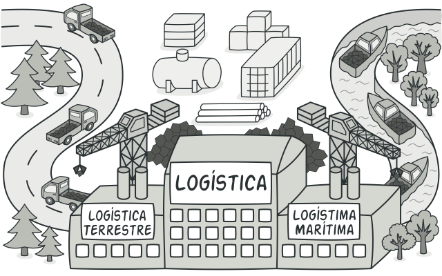
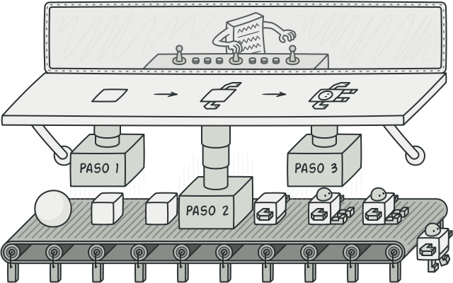

# Patrones creacionales

Los patrones creacionales proporcionan varios mecanismos de creación de objetos que incrementan la flexibilidad y la reutilización del código existente.

## Factory Method

### Propósito <a href="#intent" id="intent"></a>

<mark style="background-color:yellow;">**Factory Method**</mark> <mark style="background-color:yellow;"></mark><mark style="background-color:yellow;">es un patrón de diseño creacional que proporciona una interfaz para crear objetos en una superclase, mientras permite a las subclases alterar el tipo de objetos que se crearán.</mark>

<figure><figcaption></figcaption></figure>

### Problema <a href="#problem" id="problem"></a>

Imagina que estás creando una aplicación de gestión logística. La primera versión de tu aplicación sólo es capaz de manejar el transporte en camión, por lo que la mayor parte de tu código se encuentra dentro de la clase `Camión`.

Al cabo de un tiempo, tu aplicación se vuelve bastante popular. Cada día recibes decenas de peticiones de empresas de transporte marítimo para que incorpores la logística por mar a la aplicación.

<figure><figcaption><p>Añadir una nueva clase al programa no es tan sencillo si el resto del código ya está acoplado a clases existentes.</p></figcaption></figure>

Estupendo, ¿verdad? Pero, ¿qué pasa con el código? En este momento, la mayor parte de tu código está acoplado a la clase `Camión`. Para añadir barcos a la aplicación habría que hacer cambios en toda la base del código. Además, si más tarde decides añadir otro tipo de transporte a la aplicación, probablemente tendrás que volver a hacer todos estos cambios.

Al final acabarás con un código bastante sucio, plagado de condicionales que cambian el comportamiento de la aplicación dependiendo de la clase de los objetos de transporte.

### Solución <a href="#solution" id="solution"></a>

El patrón Factory Method sugiere que, en lugar de llamar al operador `new` para construir objetos directamente, se invoque a un método _fábrica_ especial. No te preocupes: los objetos se siguen creando a través del operador `new`, pero se invocan desde el método fábrica. Los objetos devueltos por el método fábrica a menudo se denominan _productos_.

<figure><figcaption><p>Las subclases pueden alterar la clase de los objetos devueltos por el método fábrica.</p></figcaption></figure>

A simple vista, puede parecer que este cambio no tiene sentido, ya que tan solo hemos cambiado el lugar desde donde invocamos al constructor. Sin embargo, piensa en esto: ahora puedes sobrescribir el método fábrica en una subclase y cambiar la clase de los productos creados por el método.

No obstante, hay una pequeña limitación: las subclases sólo pueden devolver productos de distintos tipos si dichos productos tienen una clase base o interfaz común. Además, el método fábrica en la clase base debe tener su tipo de retorno declarado como dicha interfaz.

<figure><figcaption><p>Todos los productos deben seguir la misma interfaz.</p></figcaption></figure>

Por ejemplo, tanto la clase `Camión` como la clase `Barco` deben implementar la interfaz `Transporte`, que declara un método llamado `entrega`. Cada clase implementa este método de forma diferente: los camiones entregan su carga por tierra, mientras que los barcos lo hacen por mar. El método fábrica dentro de la clase `LogísticaTerrestre` devuelve objetos de tipo camión, mientras que el método fábrica de la clase `LogísticaMarítima` devuelve barcos.

<figure><figcaption><p>Siempre y cuando todas las clases de producto implementen una interfaz común, podrás pasar sus objetos al código cliente sin descomponerlo.</p></figcaption></figure>

El código que utiliza el método fábrica (a menudo denominado código _cliente_) no encuentra diferencias entre los productos devueltos por varias subclases, y trata a todos los productos como la clase abstracta `Transporte`. El cliente sabe que todos los objetos de transporte deben tener el método `entrega`, pero no necesita saber cómo funciona exactamente.

### Pros y contras <a href="#pros-cons" id="pros-cons"></a>

:heavy\_check\_mark:  Evitas un acoplamiento fuerte entre el creador y los productos concretos.

:heavy\_check\_mark:  _Principio de responsabilidad única_. Puedes mover el código de creación de producto a un lugar del programa, haciendo que el código sea más fácil de mantener.

:heavy\_check\_mark:  _Principio de abierto/cerrado_. Puedes incorporar nuevos tipos de productos en el programa sin descomponer el código cliente existente.

:heavy\_multiplication\_x:  Puede ser que el código se complique, ya que debes incorporar una multitud de nuevas subclases para implementar el patrón. La situación ideal sería introducir el patrón en una jerarquía existente de clases creadoras.

## Factory Method in Java

### Producción de elementos GUI multiplataforma <a href="#example-0-title" id="example-0-title"></a>

En este ejemplo, Buttons (Botones) juega el papel de producto y los diálogos actúan como creadores.

Los distintos tipos de diálogos requieren sus propios tipos de elementos. Por eso creamos una subclase para cada tipo de diálogo y sobrescribimos sus métodos fábrica.

Ahora, cada tipo de diálogo instanciará clases de botón. El diálogo base trabaja con productos utilizando su interfaz común, por eso su código sigue siendo funcional tras todos los cambios.

```
factory_method
├── buttons
│   ├── Button.java (Interfaz común de producto)
│   ├── HtmlButton.java
│   └── WindowsButton.java
├── factory
│   ├── Dialog.java (Creador base)
│   ├── HtmlDialog.java
│   └── WindowsDialog.java
└── Demo.java (Código cliente)
```

:link: [Factory Method in Java](https://github.com/dromero-7854/software-engineering/tree/main/java-design-patterns-examples/src/factory\_method/example)

## Abstract Factory

### Propósito <a href="#intent" id="intent"></a>

**Abstract Factory** es un patrón de diseño creacional que nos permite producir familias de objetos relacionados sin especificar sus clases concretas.

<figure><figcaption></figcaption></figure>

### Problema <a href="#problem" id="problem"></a>

Imagina que estás creando un simulador de tienda de muebles. Tu código está compuesto por clases que representan lo siguiente:

1. Una familia de productos relacionados, digamos: `Silla` + `Sofá` + `Mesilla`.
2. Algunas variantes de esta familia. Por ejemplo, los productos `Silla` + `Sofá` + `Mesilla` están disponibles en estas variantes: `Moderna`, `Victoriana`, `ArtDecó`.

<figure><figcaption><p>Familias de productos y sus variantes.</p></figcaption></figure>

Necesitamos una forma de crear objetos individuales de mobiliario para que combinen con otros objetos de la misma familia. Los clientes se enfadan bastante cuando reciben muebles que no combinan.

<figure><figcaption><p>Un sofá de estilo moderno no combina con unas sillas de estilo victoriano.</p></figcaption></figure>

Además, no queremos cambiar el código existente al añadir al programa nuevos productos o familias de productos. Los comerciantes de muebles actualizan sus catálogos muy a menudo, y debemos evitar tener que cambiar el código principal cada vez que esto ocurra.

### Solución <a href="#solution" id="solution"></a>

Lo primero que sugiere el patrón Abstract Factory es que declaremos de forma explícita interfaces para cada producto diferente de la familia de productos (por ejemplo, silla, sofá o mesilla). Después podemos hacer que todas las variantes de los productos sigan esas interfaces. Por ejemplo, todas las variantes de silla pueden implementar la interfaz `Silla`, así como todas las variantes de mesilla pueden implementar la interfaz `Mesilla`, y así sucesivamente.

<figure><figcaption><p>Todas las variantes del mismo objeto deben moverse a una única jerarquía de clase.</p></figcaption></figure>

El siguiente paso consiste en declarar la _Fábrica abstracta_: una interfaz con una lista de métodos de creación para todos los productos que son parte de la familia de productos (por ejemplo, `crearSilla`, `crearSofá` y `crearMesilla`). Estos métodos deben devolver productos **abstractos** representados por las interfaces que extrajimos previamente: `Silla`, `Sofá`, `Mesilla`, etc.

<figure><figcaption><p>Cada fábrica concreta se corresponde con una variante específica del producto.</p></figcaption></figure>

Ahora bien, ¿qué hay de las variantes de los productos? Para cada variante de una familia de productos, creamos una clase de fábrica independiente basada en la interfaz `FábricaAbstracta`. Una fábrica es una clase que devuelve productos de un tipo particular. Por ejemplo, la `FábricadeMueblesModernos` sólo puede crear objetos de `SillaModerna`, `SofáModerno` y `MesillaModerna`.

El código cliente tiene que funcionar con fábricas y productos a través de sus respectivas interfaces abstractas. Esto nos permite cambiar el tipo de fábrica que pasamos al código cliente, así como la variante del producto que recibe el código cliente, sin descomponer el propio código cliente.

<figure><figcaption><p>Al cliente no le debe importar la clase concreta de la fábrica con la que funciona.</p></figcaption></figure>

Digamos que el cliente quiere una fábrica para producir una silla. El cliente no tiene que conocer la clase de la fábrica y tampoco importa el tipo de silla que obtiene. Ya sea un modelo moderno o una silla de estilo victoriano, el cliente debe tratar a todas las sillas del mismo modo, utilizando la interfaz abstracta `Silla`. Con este sistema, lo único que sabe el cliente sobre la silla es que implementa de algún modo el método `sentarse`. Además, sea cual sea la variante de silla devuelta, siempre combinará con el tipo de sofá o mesilla producida por el mismo objeto de fábrica.

Queda otro punto por aclarar: si el cliente sólo está expuesto a las interfaces abstractas, ¿cómo se crean los objetos de fábrica? Normalmente, la aplicación crea un objeto de fábrica concreto en la etapa de inicialización. Justo antes, la aplicación debe seleccionar el tipo de fábrica, dependiendo de la configuración o de los ajustes del entorno.

### Pros y contras <a href="#pros-cons" id="pros-cons"></a>

:heavy\_check\_mark:  Puedes tener la certeza de que los productos que obtienes de una fábrica son compatibles entre sí.

:heavy\_check\_mark:  Evitas un acoplamiento fuerte entre productos concretos y el código cliente.

:heavy\_check\_mark:  _Principio de responsabilidad única_. Puedes mover el código de creación de productos a un solo lugar, haciendo que el código sea más fácil de mantener.

:heavy\_check\_mark:  _Principio de abierto/cerrado_. Puedes introducir nuevas variantes de productos sin descomponer el código cliente existente.

:heavy\_multiplication\_x:  Puede ser que el código se complique más de lo que debería, ya que se introducen muchas nuevas interfaces y clases junto al patrón.

## Abstract Factory in Java

### Familias de componentes GUI multiplataforma <a href="#example-0-title" id="example-0-title"></a>

En este ejemplo, los botones y las casillas actuarán como productos. Tienen tres variantes: macOS, Windows y Linux.

La fábrica abstracta define una interfaz para crear botones y casillas. Hay tres fábricas concretas, que devuelven ambos productos en una única variante.

El código cliente funciona con fábricas y productos utilizando interfaces abstractas. Esto permite al código cliente funcionar con cualquier variante de producto creada por el objeto de fábrica.

```
abstract_factory
├── buttons
│   ├── Button.java
│   ├── MacOSButton.java
│   ├── WindowsButton.java
│   └── LinuxButton.java
├── checkboxes
│   ├── Checkbox.java
│   ├── MacOSCheckbox.java
│   ├── WindowsCheckbox.java
│   └── LinuxCheckbox.java
├── factories
│   ├── GUIFactory.java (Fábrica abstracta)
│   ├── MacOSFactory.java (Fábrica concreta macOS)
│   ├── WindowsFactory.java (Fábrica concreta Windows) 
│   └── LinuxFactory.java (Fábrica concreta Ubuntu) 
├── app
│   └── Application.java (Código cliente)
└── Demo.java (Configuración de la aplicación)
```

:link: [Abstract Factory in Java](https://github.com/dromero-7854/software-engineering/tree/main/java-design-patterns-examples/src/abstract\_factory/example)

## Builder

### Propósito <a href="#intent" id="intent"></a>

**Builder** es un patrón de diseño creacional que nos permite construir objetos complejos paso a paso. El patrón nos permite producir distintos tipos y representaciones de un objeto empleando el mismo código de construcción.

<figure><figcaption></figcaption></figure>

### Problema <a href="#problem" id="problem"></a>

Imagina un objeto complejo que requiere una inicialización laboriosa, paso a paso, de muchos campos y objetos anidados. Normalmente, este código de inicialización está sepultado dentro de un monstruoso constructor con una gran cantidad de parámetros. O, peor aún: disperso por todo el código cliente.

<figure><figcaption><p>Crear una subclase por cada configuración posible de un objeto puede complicar demasiado el programa.</p></figcaption></figure>

Por ejemplo, pensemos en cómo crear un objeto `Casa`. Para construir una casa sencilla, debemos construir cuatro paredes y un piso, así como instalar una puerta, colocar un par de ventanas y ponerle un tejado. Pero ¿qué pasa si quieres una casa más grande y luminosa, con un jardín y otros extras (como sistema de calefacción, instalación de fontanería y cableado eléctrico)?

La solución más sencilla es extender la clase base `Casa` y crear un grupo de subclases que cubran todas las combinaciones posibles de los parámetros. Pero, en cualquier caso, acabarás con una cantidad considerable de subclases. Cualquier parámetro nuevo, como el estilo del porche, exigirá que incrementes esta jerarquía aún más.

Existe otra posibilidad que no implica generar subclases. Puedes crear un enorme constructor dentro de la clase base `Casa` con todos los parámetros posibles para controlar el objeto casa. Aunque es cierto que esta solución elimina la necesidad de las subclases, genera otro problema.

<figure><figcaption><p>Un constructor con un montón de parámetros tiene su inconveniente: no todos los parámetros son necesarios todo el tiempo.</p></figcaption></figure>

En la mayoría de los casos, gran parte de los parámetros no se utilizará, lo que provocará que [las llamadas al constructor sean bastante feas](https://refactoring.guru/es/smells/long-parameter-list). Por ejemplo, solo una pequeña parte de las casas tiene piscina, por lo que los parámetros relacionados con piscinas serán inútiles en nueve de cada diez casos.

### Solución <a href="#solution" id="solution"></a>

El patrón Builder sugiere que saques el código de construcción del objeto de su propia clase y lo coloques dentro de objetos independientes llamados _constructores_.

<figure><figcaption><p>El patrón Builder te permite construir objetos complejos paso a paso. El patrón Builder no permite a otros objetos acceder al producto mientras se construye.</p></figcaption></figure>

El patrón organiza la construcción de objetos en una serie de pasos (`construirParedes`, `construirPuerta`, etc.). Para crear un objeto, se ejecuta una serie de estos pasos en un objeto constructor. Lo importante es que no necesitas invocar todos los pasos. Puedes invocar sólo aquellos que sean necesarios para producir una configuración particular de un objeto.

Puede ser que algunos pasos de la construcción necesiten una implementación diferente cuando tengamos que construir distintas representaciones del producto. Por ejemplo, las paredes de una cabaña pueden ser de madera, pero las paredes de un castillo tienen que ser de piedra.

En este caso, podemos crear varias clases constructoras distintas que implementen la misma serie de pasos de construcción, pero de forma diferente. Entonces podemos utilizar estos constructores en el proceso de construcción (por ejemplo, una serie ordenada de llamadas a los pasos de construcción) para producir distintos tipos de objetos.

<figure><figcaption><p>Los distintos constructores ejecutan la misma tarea de formas distintas.</p></figcaption></figure>

Por ejemplo, imagina un constructor que construye todo de madera y vidrio, otro que construye todo con piedra y hierro y un tercero que utiliza oro y diamantes. Al invocar la misma serie de pasos, obtenemos una casa normal del primer constructor, un pequeño castillo del segundo y un palacio del tercero. Sin embargo, esto sólo funcionaría si el código cliente que invoca los pasos de construcción es capaz de interactuar con los constructores mediante una interfaz común.

**Clase directora**

Puedes ir más lejos y extraer una serie de llamadas a los pasos del constructor que utilizas para construir un producto y ponerlas en una clase independiente llamada _directora_. La clase directora define el orden en el que se deben ejecutar los pasos de construcción, mientras que el constructor proporciona la implementación de dichos pasos.

<figure><figcaption><p>La clase directora sabe qué pasos de construcción ejecutar para lograr un producto que funcione.</p></figcaption></figure>

No es estrictamente necesario tener una clase directora en el programa, ya que se pueden invocar los pasos de construcción en un orden específico directamente desde el código cliente. No obstante, la clase directora puede ser un buen lugar donde colocar distintas rutinas de construcción para poder reutilizarlas a lo largo del programa.

Además, la clase directora esconde por completo los detalles de la construcción del producto al código cliente. El cliente sólo necesita asociar un objeto constructor con una clase directora, utilizarla para iniciar la construcción, y obtener el resultado del objeto constructor.

### Pros y contras <a href="#pros-cons" id="pros-cons"></a>

:heavy\_check\_mark:  Puedes construir objetos paso a paso, aplazar pasos de la construcción o ejecutar pasos de forma recursiva.

:heavy\_check\_mark:  Puedes reutilizar el mismo código de construcción al construir varias representaciones de productos.

:heavy\_check\_mark:  _Principio de responsabilidad única_. Puedes aislar un código de construcción complejo de la lógica de negocio del producto.

:heavy\_multiplication\_x:  La complejidad general del código aumenta, ya que el patrón exige la creación de varias clases nuevas.

## **Builder in Java**

### Fabricación de autos paso a paso <a href="#example-0-title" id="example-0-title"></a>

En este ejemplo, el patrón Builder permite la construcción paso a paso de distintos modelos de auto.

El ejemplo muestra también cómo el patrón Builder crea productos de distinto tipo (manual del auto) utilizando los mismos pasos de construcción.

El Director controla el orden de construcción. Sabe qué pasos de construcción invocar para producir éste o aquel modelo de auto. Trabaja con los constructores únicamente a través de su interfaz común. Esto permite pasar distintos tipos de constructores al director.

El resultado final se extrae del objeto constructor porque el director no puede saber el tipo de producto resultante. Sólo el objeto del constructor sabe exactamente lo que construye.

```
builder
├── builders
│   ├── Builder.java (Interfaz común del constructor)
│   ├── CarBuilder.java (Constructor de auto)
│   └── CarManualBuilder.java (Constructor de manual de auto)
├── cars
│   ├── Car.java (Producto auto)
│   ├── Manual.java (Producto manual)
│   └── CarType.java
├── components
│   ├── Engine.java
│   ├── GPSNavigator.java
│   ├── Transmission.java
│   └── TripComputer.java
├── director
│   └── Director.java (El director controla los constructores
└── Demo.java (Código cliente)
```

:link: [Builder in Java](https://github.com/dromero-7854/software-engineering/tree/main/java-design-patterns-examples/src/builder/example)

## Prototype

### Propósito <a href="#intent" id="intent"></a>

**Prototype** es un patrón de diseño creacional que nos permite copiar objetos existentes sin que el código dependa de sus clases.

<figure><figcaption></figcaption></figure>

### Problema <a href="#problem" id="problem"></a>

Digamos que tienes un objeto y quieres crear una copia exacta de él. ¿Cómo lo harías? En primer lugar, debes crear un nuevo objeto de la misma clase. Después debes recorrer todos los campos del objeto original y copiar sus valores en el nuevo objeto.

¡Bien! Pero hay una trampa. No todos los objetos se pueden copiar de este modo, porque algunos de los campos del objeto pueden ser privados e invisibles desde fuera del propio objeto.

<figure><figcaption><p>No siempre es posible copiar un objeto “desde fuera”.</p></figcaption></figure>

Hay otro problema con el enfoque directo. Dado que debes conocer la clase del objeto para crear un duplicado, el código se vuelve dependiente de esa clase. Si esta dependencia adicional no te da miedo, todavía hay otra trampa. En ocasiones tan solo conocemos la interfaz que sigue el objeto, pero no su clase concreta, cuando, por ejemplo, un parámetro de un método acepta cualquier objeto que siga cierta interfaz.

### Solución <a href="#solution" id="solution"></a>

El patrón Prototype delega el proceso de clonación a los propios objetos que están siendo clonados. El patrón declara una interfaz común para todos los objetos que soportan la clonación. Esta interfaz nos permite clonar un objeto sin acoplar el código a la clase de ese objeto. Normalmente, dicha interfaz contiene un único método `clonar`.

La implementación del método `clonar` es muy parecida en todas las clases. El método crea un objeto a partir de la clase actual y lleva todos los valores de campo del viejo objeto, al nuevo. Se puede incluso copiar campos privados, porque la mayoría de los lenguajes de programación permite a los objetos acceder a campos privados de otros objetos que pertenecen a la misma clase.

Un objeto que soporta la clonación se denomina _prototipo_. Cuando tus objetos tienen decenas de campos y miles de configuraciones posibles, la clonación puede servir como alternativa a la creación de subclases.

<figure><figcaption><p>Los prototipos prefabricados pueden ser una alternativa a las subclases.</p></figcaption></figure>

Funciona así: se crea un grupo de objetos configurados de maneras diferentes. Cuando necesites un objeto como el que has configurado, clonas un prototipo en lugar de construir un nuevo objeto desde cero.

### Pros y contras <a href="#pros-cons" id="pros-cons"></a>

:heavy\_check\_mark:  Puedes clonar objetos sin acoplarlos a sus clases concretas.

:heavy\_check\_mark:  Puedes evitar un código de inicialización repetido clonando prototipos prefabricados.

:heavy\_check\_mark:  Puedes crear objetos complejos con más facilidad.

:heavy\_check\_mark:  Obtienes una alternativa a la herencia al tratar con preajustes de configuración para objetos complejos.

:heavy\_multiplication\_x:  Clonar objetos complejos con referencias circulares puede resultar complicado.

## Prototype in Java

### Copiar formas gráficas <a href="#example-0-title" id="example-0-title"></a>

Vamos a ver cómo se puede implementar el patrón Prototype sin la interfaz estándar `Cloneable`.

```
prototype
├── shapes (Lista de formas)
│   ├── Shape.java (Interfaz común de las formas)
│   ├── Circle.java
│   └── Rectangle.java
└── Demo.java (Código cliente)
```

### Registro del prototipo

Puedes implementar un registro centralizado del prototipo (o fábrica), que contendría un grupo de objetos prototipo predefinidos. De este modo, podrías extraer nuevos objetos de la fábrica sin pasar su nombre u otros parámetros. La fábrica buscará un prototipo adecuado, lo clonará y te devolverá una copia.

```
prototype
└── cache
    ├── BundledShapeCache.java (Fábrica de prototipos)
    └── Demo.java (Ejemplo de clonación)
```

:link: [Prototype in Java](https://github.com/dromero-7854/software-engineering/tree/main/java-design-patterns-examples/src/prototype/example)

## Singleton

### Propósito <a href="#intent" id="intent"></a>

**Singleton** es un patrón de diseño creacional que nos permite asegurarnos de que una clase tenga una única instancia, a la vez que proporciona un punto de acceso global a dicha instancia.

<figure><figcaption></figcaption></figure>

### Problema <a href="#problem" id="problem"></a>

El patrón Singleton resuelve dos problemas al mismo tiempo, vulnerando el _Principio de responsabilidad única_:

1.  **Garantizar que una clase tenga una única instancia**. ¿Por qué querría alguien controlar cuántas instancias tiene una clase? El motivo más habitual es controlar el acceso a algún recurso compartido, por ejemplo, una base de datos o un archivo.

    Funciona así: imagina que has creado un objeto y al cabo de un tiempo decides crear otro nuevo. En lugar de recibir un objeto nuevo, obtendrás el que ya habías creado.

    Ten en cuenta que este comportamiento es imposible de implementar con un constructor normal, ya que una llamada al constructor siempre **debe** devolver un nuevo objeto por diseño.
2. **Proporcionar un punto de acceso global a dicha instancia**. ¿Recuerdas esas variables globales que utilizaste (bueno, sí, fui yo) para almacenar objetos esenciales? Aunque son muy útiles, también son poco seguras, ya que cualquier código podría sobrescribir el contenido de esas variables y descomponer la aplicación.

Al igual que una variable global, el patrón Singleton nos permite acceder a un objeto desde cualquier parte del programa. No obstante, también evita que otro código sobreescriba esa instancia.

Este problema tiene otra cara: no queremos que el código que resuelve el primer problema se encuentre disperso por todo el programa. Es mucho más conveniente tenerlo dentro de una clase, sobre todo si el resto del código ya depende de ella.

Hoy en día el patrón Singleton se ha popularizado tanto que la gente suele llamar _singleton_ a cualquier patrón, incluso si solo resuelve uno de los problemas antes mencionados.

### Solución <a href="#solution" id="solution"></a>

Todas las implementaciones del patrón Singleton tienen estos dos pasos en común:

* Hacer privado el constructor por defecto para evitar que otros objetos utilicen el operador `new` con la clase Singleton.
* Crear un método de creación estático que actúe como constructor. Tras bambalinas, este método invoca al constructor privado para crear un objeto y lo guarda en un campo estático. Las siguientes llamadas a este método devuelven el objeto almacenado en caché.

Si tu código tiene acceso a la clase Singleton, podrá invocar su método estático. De esta manera, cada vez que se invoque este método, siempre se devolverá el mismo objeto.

### Pros y contras <a href="#pros-cons" id="pros-cons"></a>

:heavy\_check\_mark:  Puedes tener la certeza de que una clase tiene una única instancia.

:heavy\_check\_mark:  Obtienes un punto de acceso global a dicha instancia.

:heavy\_check\_mark:  El objeto Singleton solo se inicializa cuando se requiere por primera vez.

:heavy\_multiplication\_x:  Vulnera el _Principio de responsabilidad única_. El patrón resuelve dos problemas al mismo tiempo.

:heavy\_multiplication\_x:  El patrón Singleton puede enmascarar un mal diseño, por ejemplo, cuando los componentes del programa saben demasiado los unos sobre los otros.

:heavy\_multiplication\_x:  El patrón requiere de un tratamiento especial en un entorno con múltiples hilos de ejecución, para que varios hilos no creen un objeto Singleton varias veces.

:heavy\_multiplication\_x:  Puede resultar complicado realizar la prueba unitaria del código cliente del Singleton porque muchos _frameworks_ de prueba dependen de la herencia a la hora de crear objetos simulados (mock objects). Debido a que la clase Singleton es privada y en la mayoría de los lenguajes resulta imposible sobrescribir métodos estáticos, tendrás que pensar en una manera original de simular el Singleton. O, simplemente, no escribas las pruebas. O no utilices el patrón Singleton.

## Singleton in Java

### Singleton ingenuo (hilo único) <a href="#example-0-title" id="example-0-title"></a>

Es muy fácil implementar un Singleton descuidado. Tan solo necesitas esconder el constructor e implementar un método de creación estático.

```
singleton
└── a_singlethread
    ├── Singleton.java
    └── DemoSingleThread.java (Código cliente)
```

### Singleton ingenuo (multihilo) <a href="#example-1-title" id="example-1-title"></a>

La misma clase se comporta de forma incorrecta en un entorno de múltiples hilos. Los múltiples hilos pueden llamar al método de creación de forma simultánea y obtener varias instancias de la clase Singleton.

```
singleton
└── b_multithread
    ├── Singleton.java
    └── DemoMultiThread.java (Código cliente)
```

### Singleton con seguridad en los hilos y carga diferida <a href="#example-2-title" id="example-2-title"></a>

Para arreglar el problema, debes sincronizar hilos durante la primera creación del objeto Singleton.

```
singleton
└── c_multithread_synchronized
    ├── Singleton.java
    └── DemoMultiThread.java (Código cliente)
```

:link: [Singleton in Java](https://github.com/dromero-7854/software-engineering/tree/main/java-design-patterns-examples/src/singleton/example)
