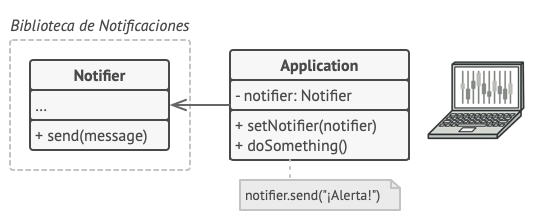
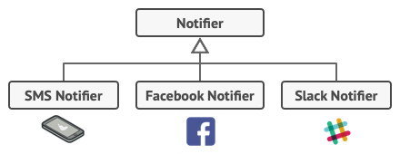
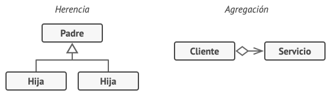
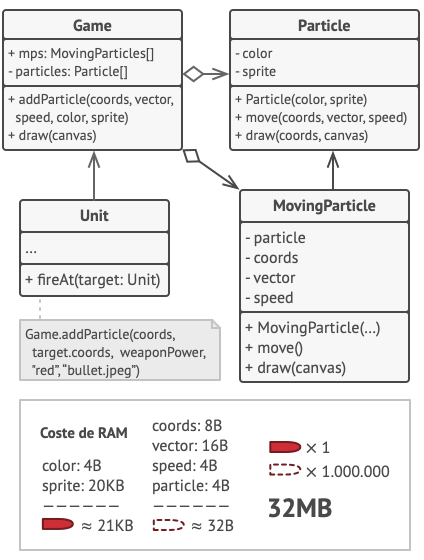

# Patrones estructurales

Los patrones estructurales explican cómo ensamblar objetos y clases en estructuras más grandes, a la vez que se mantiene la flexibilidad y eficiencia de estas estructuras.

## Adapter

### Propósito <a href="#intent" id="intent"></a>

**Adapter** es un patrón de diseño estructural que permite la colaboración entre objetos con interfaces incompatibles.

<figure><figcaption></figcaption></figure>

### Problema <a href="#problem" id="problem"></a>

Imagina que estás creando una aplicación de monitoreo del mercado de valores. La aplicación descarga la información de bolsa desde varias fuentes en formato XML para presentarla al usuario con bonitos gráficos y diagramas.

En cierto momento, decides mejorar la aplicación integrando una inteligente biblioteca de análisis de una tercera persona. Pero hay una trampa: la biblioteca de análisis solo funciona con datos en formato JSON.

<figure><figcaption><p>No puedes utilizar la biblioteca de análisis “tal cual” porque ésta espera los datos en un formato que es incompatible con tu aplicación.</p></figcaption></figure>

Podrías cambiar la biblioteca para que funcione con XML. Sin embargo, esto podría descomponer parte del código existente que depende de la biblioteca. Y, lo que es peor, podrías no tener siquiera acceso al código fuente de la biblioteca, lo que hace imposible esta solución.

### Solución <a href="#solution" id="solution"></a>

Puedes crear un _adaptador_. Se trata de un objeto especial que convierte la interfaz de un objeto, de forma que otro objeto pueda comprenderla.

Un adaptador envuelve uno de los objetos para esconder la complejidad de la conversión que tiene lugar tras bambalinas. El objeto envuelto ni siquiera es consciente de la existencia del adaptador. Por ejemplo, puedes envolver un objeto que opera con metros y kilómetros con un adaptador que convierte todos los datos al sistema anglosajón, es decir, pies y millas.

Los adaptadores no solo convierten datos a varios formatos, sino que también ayudan a objetos con distintas interfaces a colaborar. Funciona así:

1. El adaptador obtiene una interfaz compatible con uno de los objetos existentes.
2. Utilizando esta interfaz, el objeto existente puede invocar con seguridad los métodos del adaptador.
3. Al recibir una llamada, el adaptador pasa la solicitud al segundo objeto, pero en un formato y orden que ese segundo objeto espera.

En ocasiones se puede incluso crear un adaptador de dos direcciones que pueda convertir las llamadas en ambos sentidos.

<figure><figcaption></figcaption></figure>

Regresemos a nuestra aplicación del mercado de valores. Para resolver el dilema de los formatos incompatibles, puedes crear adaptadores de XML a JSON para cada clase de la biblioteca de análisis con la que trabaje tu código directamente. Después ajustas tu código para que se comunique con la biblioteca únicamente a través de estos adaptadores. Cuando un adaptador recibe una llamada, traduce los datos XML entrantes a una estructura JSON y pasa la llamada a los métodos adecuados de un objeto de análisis envuelto.

### Pros y contras <a href="#pros-cons" id="pros-cons"></a>

:heavy\_check\_mark:  _Principio de responsabilidad única_. Puedes separar la interfaz o el código de conversión de datos de la lógica de negocio primaria del programa.

:heavy\_check\_mark:  _Principio de abierto/cerrado_. Puedes introducir nuevos tipos de adaptadores al programa sin descomponer el código cliente existente, siempre y cuando trabajen con los adaptadores a través de la interfaz con el cliente.

:heavy\_multiplication\_x:  La complejidad general del código aumenta, ya que debes introducir un grupo de nuevas interfaces y clases. En ocasiones resulta más sencillo cambiar la clase de servicio de modo que coincida con el resto de tu código.

## Adapter in Java

### Encajar piezas cuadradas en agujeros redondos <a href="#example-0-title" id="example-0-title"></a>

Este sencillo ejemplo muestra el modo en que un Adapter puede hacer que objetos incompatibles trabajen juntos.

```
adapter
├── round 
│   ├── RoundHole.java (Agujeros redondos)
│   └── RoundPeg.java (Piezas redondas)
├── square
│   └── SquarePeg.java (Piezas cuadradas)
├── adapters
│   └── SquarePegAdapter.java (Adaptador de piezas cuadradas para agujeros redondos) 
└── Demo.java (Código cliente)
```

:link: [Adapter in Java](https://github.com/dromero-7854/software-engineering/tree/main/java-design-patterns-examples/src/adapter/example)

## Bridge

### Propósito <a href="#intent" id="intent"></a>

**Bridge** es un patrón de diseño estructural que te permite dividir una clase grande, o un grupo de clases estrechamente relacionadas, en dos jerarquías separadas (abstracción e implementación) que pueden desarrollarse independientemente la una de la otra.

<figure><figcaption></figcaption></figure>

### Problema <a href="#problem" id="problem"></a>

¿_Abstracción?_ ¿_Implementación_? ¿Asusta? Mantengamos la calma y veamos un ejemplo sencillo.

Digamos que tienes una clase geométrica `Forma` con un par de subclases: `Círculo` y `Cuadrado`. Deseas extender esta jerarquía de clase para que incorpore colores, por lo que planeas crear las subclases de forma `Rojo` y `Azul`. Sin embargo, como ya tienes dos subclases, tienes que crear cuatro combinaciones de clase, como `CírculoAzul` y `CuadradoRojo`.

<figure><figcaption><p>El número de combinaciones de clase crece en progresión geométrica.</p></figcaption></figure>

Añadir nuevos tipos de forma y color a la jerarquía hará que ésta crezca exponencialmente. Por ejemplo, para añadir una forma de triángulo deberás introducir dos subclases, una para cada color. Y, después, para añadir un nuevo color habrá que crear tres subclases, una para cada tipo de forma. Cuanto más avancemos, peor será.

### Solución <a href="#solution" id="solution"></a>

Este problema se presenta porque intentamos extender las clases de forma en dos dimensiones independientes: por forma y por color. Es un problema muy habitual en la herencia de clases.

El patrón Bridge intenta resolver este problema pasando de la herencia a la composición del objeto. Esto quiere decir que se extrae una de las dimensiones a una jerarquía de clases separada, de modo que las clases originales referencian un objeto de la nueva jerarquía, en lugar de tener todo su estado y sus funcionalidades dentro de una clase.

<figure><figcaption><p>Puedes evitar la explosión de una jerarquía de clase transformándola en varias jerarquías relacionadas.</p></figcaption></figure>

Con esta solución, podemos extraer el código relacionado con el color y colocarlo dentro de su propia clase, con dos subclases: `Rojo` y `Azul`. La clase `Forma` obtiene entonces un campo de referencia que apunta a uno de los objetos de color. Ahora la forma puede delegar cualquier trabajo relacionado con el color al objeto de color vinculado. Esa referencia actuará como un puente entre las clases `Forma` y `Color`. En adelante, añadir nuevos colores no exigirá cambiar la jerarquía de forma y viceversa.

**Abstracción e implementación**

El libro de la GoF  introduce los términos _Abstracción_ e _Implementación_ como parte de la definición del patrón Bridge. En mi opinión, los términos suenan demasiado académicos y provocan que el patrón parezca más complicado de lo que es en realidad. Una vez leído el sencillo ejemplo con las formas y los colores, vamos a descifrar el significado que esconden las temibles palabras del libro de esta banda de cuatro.

La _Abstracción_ (también llamada _interfaz_) es una capa de control de alto nivel para una entidad. Esta capa no tiene que hacer ningún trabajo real por su cuenta, sino que debe delegar el trabajo a la capa de _implementación_ (también llamada _plataforma_).

Ten en cuenta que no estamos hablando de las _interfaces_ o las _clases abstractas_ de tu lenguaje de programación. Son cosas diferentes.

Cuando hablamos de aplicación reales, la abstracción puede representarse por una interfaz gráfica de usuario (GUI), y la implementación puede ser el código del sistema operativo subyacente (API) a la que la capa GUI llama en respuesta a las interacciones del usuario.

En términos generales, puedes extender esa aplicación en dos direcciones independientes:

* Tener varias GUI diferentes (por ejemplo, personalizadas para clientes regulares o administradores).
* Soportar varias API diferentes (por ejemplo, para poder lanzar la aplicación con Windows, Linux y macOS).

En el peor de los casos, esta aplicación podría asemejarse a un plato gigante de espagueti, en el que cientos de condicionales conectan distintos tipos de GUI con varias API por todo el código.

<figure><figcaption><p>Realizar incluso un cambio sencillo en una base de código monolítica es bastante difícil porque debes comprender <em>todo el asunto</em> muy bien. Es mucho más sencillo realizar cambios en módulos más pequeños y bien definidos.</p></figcaption></figure>

Puedes poner orden en este caos metiendo el código relacionado con combinaciones específicas interfaz-plataforma dentro de clases independientes. Sin embargo, pronto descubrirás que hay _muchas_ de estas clases. La jerarquía de clase crecerá exponencialmente porque añadir una nueva GUI o soportar una API diferente exigirá que se creen más y más clases.

Intentemos resolver este problema con el patrón Bridge, que nos sugiere que dividamos las clases en dos jerarquías:

* Abstracción: la capa GUI de la aplicación.
* Implementación: las API de los sistemas operativos.

<figure><figcaption><p>Una de las formas de estructurar una aplicación multiplataforma.</p></figcaption></figure>

El objeto de la abstracción controla la apariencia de la aplicación, delegando el trabajo real al objeto de la implementación vinculado. Las distintas implementaciones son intercambiables siempre y cuando sigan una interfaz común, permitiendo a la misma GUI funcionar con Windows y Linux.

En consecuencia, puedes cambiar las clases de la GUI sin tocar las clases relacionadas con la API. Además, añadir soporte para otro sistema operativo sólo requiere crear una subclase en la jerarquía de implementación.

### Pros y contras <a href="#pros-cons" id="pros-cons"></a>

:heavy\_check\_mark:  Puedes crear clases y aplicaciones independientes de plataforma.

:heavy\_check\_mark:  El código cliente funciona con abstracciones de alto nivel. No está expuesto a los detalles de la plataforma.

:heavy\_check\_mark:  _Principio de abierto/cerrado_. Puedes introducir nuevas abstracciones e implementaciones independientes entre sí.

:heavy\_check\_mark:  _Principio de responsabilidad única_. Puedes centrarte en la lógica de alto nivel en la abstracción y en detalles de la plataforma en la implementación.

:heavy\_multiplication\_x:  Puede ser que el código se complique si aplicas el patrón a una clase muy cohesionada.

## Bridge in Java

### Bridge (puente) entre dispositivos y controles remotos <a href="#example-0-title" id="example-0-title"></a>

Este ejemplo muestra la separación entre las clases de los remotos y los dispositivos que controlan.

Los remotos actúan como abstracciones, y los dispositivos son sus implementaciones. Gracias a las interfaces comunes, los mismos remotos pueden funcionar con distintos dispositivos y viceversa.

El patrón Bridge permite cambiar o incluso crear nuevas clases sin tocar el código de la jerarquía opuesta.

```
bridge
├── devices 
│   ├── Device.java (Interfaz común de todos los dispositivos)
│   ├── Radio.java
│   └── TV.java
├── remotes
│   ├── Remote.java (Interfaz común de todos los remotos)
│   ├── BasicRemote.java
│   └── AdvancedRemote.java
└── Demo.java (Código cliente)
```

:link: [Bridge in Java](https://github.com/dromero-7854/software-engineering/tree/main/java-design-patterns-examples/src/bridge/example)

## Composite

### Propósito <a href="#intent" id="intent"></a>

**Composite** es un patrón de diseño estructural que te permite componer objetos en estructuras de árbol y trabajar con esas estructuras como si fueran objetos individuales.

<figure><figcaption></figcaption></figure>

### Problema <a href="#problem" id="problem"></a>

El uso del patrón Composite sólo tiene sentido cuando el modelo central de tu aplicación puede representarse en forma de árbol.

Por ejemplo, imagina que tienes dos tipos de objetos: `Productos` y `Cajas`. Una `Caja` puede contener varios `Productos` así como cierto número de `Cajas` más pequeñas. Estas `Cajas` pequeñas también pueden contener algunos `Productos` o incluso `Cajas` más pequeñas, y así sucesivamente.

Digamos que decides crear un sistema de pedidos que utiliza estas clases. Los pedidos pueden contener productos sencillos sin envolver, así como cajas llenas de productos... y otras cajas. ¿Cómo determinarás el precio total de ese pedido?

<figure><figcaption><p>Un pedido puede incluir varios productos empaquetados en cajas, que a su vez están empaquetados en cajas más grandes y así sucesivamente. La estructura se asemeja a un árbol boca abajo.</p></figcaption></figure>

Puedes intentar la solución directa: desenvolver todas las cajas, repasar todos los productos y calcular el total. Esto sería viable en el mundo real; pero en un programa no es tan fácil como ejecutar un bucle. Tienes que conocer de antemano las clases de `Productos` y `Cajas` a iterar, el nivel de anidación de las cajas y otros detalles desagradables. Todo esto provoca que la solución directa sea demasiado complicada, o incluso imposible.

### Solución <a href="#solution" id="solution"></a>

El patrón Composite sugiere que trabajes con `Productos` y `Cajas` a través de una interfaz común que declara un método para calcular el precio total.

¿Cómo funcionaría este método? Para un producto, sencillamente devuelve el precio del producto. Para una caja, recorre cada artículo que contiene la caja, pregunta su precio y devuelve un total por la caja. Si uno de esos artículos fuera una caja más pequeña, esa caja también comenzaría a repasar su contenido y así sucesivamente, hasta que se calcule el precio de todos los componentes internos. Una caja podría incluso añadir costos adicionales al precio final, como costos de empaquetado.

<figure><figcaption><p>El patrón Composite te permite ejecutar un comportamiento de forma recursiva sobre todos los componentes de un árbol de objetos.</p></figcaption></figure>

La gran ventaja de esta solución es que no tienes que preocuparte por las clases concretas de los objetos que componen el árbol. No tienes que saber si un objeto es un producto simple o una sofisticada caja. Puedes tratarlos a todos por igual a través de la interfaz común. Cuando invocas un método, los propios objetos pasan la solicitud a lo largo del árbol.

### Pros y contras <a href="#pros-cons" id="pros-cons"></a>

:heavy\_check\_mark:  Puedes trabajar con estructuras de árbol complejas con mayor comodidad: utiliza el polimorfismo y la recursión en tu favor.

:heavy\_check\_mark:  _Principio de abierto/cerrado_. Puedes introducir nuevos tipos de elemento en la aplicación sin descomponer el código existente, que ahora funciona con el árbol de objetos.

:heavy\_multiplication\_x:  Puede resultar difícil proporcionar una interfaz común para clases cuya funcionalidad difiere demasiado. En algunos casos, tendrás que generalizar en exceso la interfaz componente, provocando que sea más difícil de comprender.

## Composite in Java

### Formas gráficas simples y compuestas <a href="#example-0-title" id="example-0-title"></a>

Este ejemplo muestra cómo crear formas gráficas complejas compuestas por formas simples, y cómo tratarlas a ambas de manera uniforme.

```
composite
├── shapes 
│   ├── Shape.java (Interfaz común de las formas)
│   ├── BaseShape.java (Forma abstracta con funcionalidad básica)
│   ├── Dot.java
│   ├── Circle.java
│   ├── Rectangle.java
│   └── CompoundShape.java (Forma compuesta, que consiste en otros objetos de forma
├── editor 
│   └── ImageEditor.java (Editor de forma)
└── Demo.java (Código cliente)
```

:link: [Composite in Java](https://github.com/dromero-7854/software-engineering/tree/main/java-design-patterns-examples/src/composite/example)

## Decorator

### Propósito <a href="#intent" id="intent"></a>

**Decorator** es un patrón de diseño estructural que te permite añadir funcionalidades a objetos colocando estos objetos dentro de objetos encapsuladores especiales que contienen estas funcionalidades.

<figure><figcaption></figcaption></figure>

### Problema <a href="#problem" id="problem"></a>

Imagina que estás trabajando en una biblioteca de notificaciones que permite a otros programas notificar a sus usuarios acerca de eventos importantes.

La versión inicial de la biblioteca se basaba en la clase `Notificador` que solo contaba con unos cuantos campos, un constructor y un único método `send`. El método podía aceptar un argumento de mensaje de un cliente y enviar el mensaje a una lista de correos electrónicos que se pasaban a la clase notificadora a través de su constructor. Una aplicación de un tercero que actuaba como cliente debía crear y configurar el objeto notificador una vez y después utilizarlo cada vez que sucediera algo importante.

<figure><figcaption><p>Un programa puede utilizar la clase notificadora para enviar notificaciones sobre eventos importantes a un grupo predefinido de correos electrónicos.</p></figcaption></figure>

En cierto momento te das cuenta de que los usuarios de la biblioteca esperan algo más que unas simples notificaciones por correo. A muchos de ellos les gustaría recibir mensajes SMS sobre asuntos importantes. Otros querrían recibir las notificaciones por Facebook y, por supuesto, a los usuarios corporativos les encantaría recibir notificaciones por Slack.

<figure><figcaption><p>Cada tipo de notificación se implementa como una subclase de la clase notificadora.</p></figcaption></figure>

No puede ser muy complicado ¿verdad? Extendiste la clase `Notificador` y metiste los métodos adicionales de notificación dentro de nuevas subclases. Ahora el cliente debería instanciar la clase notificadora deseada y utilizarla para el resto de notificaciones.

Pero entonces alguien te hace una pregunta razonable: “¿Por qué no se pueden utilizar varios tipos de notificación al mismo tiempo? Si tu casa está en llamas, probablemente quieras que te informen a través de todos los canales”.

Intentaste solucionar ese problema creando subclases especiales que combinaban varios métodos de notificación dentro de una clase. Sin embargo, enseguida resultó evidente que esta solución inflaría el código en gran medida, no sólo el de la biblioteca, sino también el código cliente.

<figure><figcaption><p>Explosión combinatoria de subclases.</p></figcaption></figure>

Debes encontrar alguna otra forma de estructurar las clases de las notificaciones para no alcanzar cifras que rompan accidentalmente un récord Guinness.

### Solución <a href="#solution" id="solution"></a>

Cuando tenemos que alterar la funcionalidad de un objeto, lo primero que se viene a la mente es extender una clase. No obstante, la herencia tiene varias limitaciones importantes de las que debes ser consciente.

* La herencia es estática. No se puede alterar la funcionalidad de un objeto existente durante el tiempo de ejecución. Sólo se puede sustituir el objeto completo por otro creado a partir de una subclase diferente.
* Las subclases sólo pueden tener una clase padre. En la mayoría de lenguajes, la herencia no permite a una clase heredar comportamientos de varias clases al mismo tiempo.

Una de las formas de superar estas limitaciones es empleando la _Agregación_ o la _Composición_ en lugar de la _Herencia_. Ambas alternativas funcionan prácticamente del mismo modo: un objeto _tiene una_ referencia a otro y le delega parte del trabajo, mientras que con la herencia, el propio objeto _puede_ realizar ese trabajo, heredando el comportamiento de su superclase.

Con esta nueva solución puedes sustituir fácilmente el objeto “ayudante” vinculado por otro, cambiando el comportamiento del contenedor durante el tiempo de ejecución. Un objeto puede utilizar el comportamiento de varias clases con referencias a varios objetos, delegándoles todo tipo de tareas. La agregación/composición es el principio clave que se esconde tras muchos patrones de diseño, incluyendo el Decorator. A propósito, regresemos a la discusión sobre el patrón.

<figure><figcaption><p>Herencia vs. Agregación</p></figcaption></figure>

“Wrapper” (envoltorio, en inglés) es el sobrenombre alternativo del patrón Decorator, que expresa claramente su idea principal. Un _wrapper_ es un objeto que puede vincularse con un objeto _objetivo_. El wrapper contiene el mismo grupo de métodos que el objetivo y le delega todas las solicitudes que recibe. No obstante, el wrapper puede alterar el resultado haciendo algo antes o después de pasar la solicitud al objetivo.

¿Cuándo se convierte un simple wrapper en el verdadero decorador? Como he mencionado, el wrapper implementa la misma interfaz que el objeto envuelto. Éste es el motivo por el que, desde la perspectiva del cliente, estos objetos son idénticos. Haz que el campo de referencia del wrapper acepte cualquier objeto que siga esa interfaz. Esto te permitirá _envolver_ un objeto en varios wrappers, añadiéndole el comportamiento combinado de todos ellos.

En nuestro ejemplo de las notificaciones, dejemos la sencilla funcionalidad de las notificaciones por correo electrónico dentro de la clase base `Notificador`, pero convirtamos el resto de los métodos de notificación en decoradores.

<figure><figcaption><p>Varios métodos de notificación se convierten en decoradores.</p></figcaption></figure>

El código cliente debe envolver un objeto notificador básico dentro de un grupo de decoradores que satisfagan las preferencias del cliente. Los objetos resultantes se estructurarán como una pila.

<figure><figcaption><p>Las aplicaciones pueden configurar pilas complejas de decoradores de notificación.</p></figcaption></figure>

El último decorador de la pila será el objeto con el que el cliente trabaja. Debido a que todos los decoradores implementan la misma interfaz que la notificadora base, al resto del código cliente no le importa si está trabajando con el objeto notificador “puro” o con el decorado.

Podemos aplicar la misma solución a otras funcionalidades, como el formateo de mensajes o la composición de una lista de destinatarios. El cliente puede decorar el objeto con los decoradores personalizados que desee, siempre y cuando sigan la misma interfaz que los demás.

### Pros y contras <a href="#pros-cons" id="pros-cons"></a>

:heavy\_check\_mark:  Puedes extender el comportamiento de un objeto sin crear una nueva subclase.

:heavy\_check\_mark:  Puedes añadir o eliminar responsabilidades de un objeto durante el tiempo de ejecución.

:heavy\_check\_mark:  Puedes combinar varios comportamientos envolviendo un objeto con varios decoradores.

:heavy\_check\_mark:  Principio de responsabilidad única. Puedes dividir una clase monolítica que implementa muchas variantes posibles de comportamiento, en varias clases más pequeñas.

:heavy\_multiplication\_x:  Resulta difícil eliminar un wrapper específico de la pila de wrappers.

:heavy\_multiplication\_x:  Es difícil implementar un decorador de tal forma que su comportamiento no dependa del orden en la pila de decoradores.

:heavy\_multiplication\_x:  El código de configuración inicial de las capas pueden tener un aspecto desagradable.

## Decorator in Java

### Decoradores de codificación y compresión <a href="#example-0-title" id="example-0-title"></a>

Este ejemplo muestra cómo puedes ajustar el comportamiento de un objeto sin cambiar su código.

Inicialmente, la clase de la lógica de negocio sólo podía leer y escribir datos en texto sin formato. Después creamos varias pequeñas clases envoltorio que añaden un nuevo comportamiento tras ejecutar operaciones estándar en un objeto envuelto.

El primer _wrapper_ codifica y decodifica información, y el segundo comprime y extrae datos.

Puedes incluso combinar estos _wrappers_ envolviendo un decorador con otro.

```
decorator
├── decorators 
│   ├── DataSource.java (Una interfaz común de datos que define operaciones de leer y escribir)
│   ├── FileDataSource.java (Escritor-lector de datos simple)
│   ├── DataSourceDecorator.java (Decorador abstracto base)
│   ├── EncryptionDecorator.java (Decorador de codificación)
│   └── CompressionDecorator.java (Decorador de compresión)
└── Demo.java (Código cliente)
```

:link: [Decorator in Java](https://github.com/dromero-7854/software-engineering/tree/main/java-design-patterns-examples/src/decorator/example)

## Facade

### Propósito <a href="#intent" id="intent"></a>

**Facade** es un patrón de diseño estructural que proporciona una interfaz simplificada a una biblioteca, un framework o cualquier otro grupo complejo de clases.

<figure><figcaption></figcaption></figure>

### Problema <a href="#problem" id="problem"></a>

Imagina que debes lograr que tu código trabaje con un amplio grupo de objetos que pertenecen a una sofisticada biblioteca o _framework_. Normalmente, debes inicializar todos esos objetos, llevar un registro de las dependencias, ejecutar los métodos en el orden correcto y así sucesivamente.

Como resultado, la lógica de negocio de tus clases se vería estrechamente acoplada a los detalles de implementación de las clases de terceros, haciéndola difícil de comprender y mantener.

### Solución <a href="#solution" id="solution"></a>

Una fachada es una clase que proporciona una interfaz simple a un subsistema complejo que contiene muchas partes móviles. Una fachada puede proporcionar una funcionalidad limitada en comparación con trabajar directamente con el subsistema. Sin embargo, tan solo incluye las funciones realmente importantes para los clientes.

Tener una fachada resulta útil cuando tienes que integrar tu aplicación con una biblioteca sofisticada con decenas de funciones, de la cual sólo necesitas una pequeña parte.

Por ejemplo, una aplicación que sube breves vídeos divertidos de gatos a las redes sociales, podría potencialmente utilizar una biblioteca de conversión de vídeo profesional. Sin embargo, lo único que necesita en realidad es una clase con el método simple `codificar(nombreDelArchivo, formato)`. Una vez que crees dicha clase y la conectes con la biblioteca de conversión de vídeo, tendrás tu primera fachada.

### Pros y contras <a href="#pros-cons" id="pros-cons"></a>

:heavy\_check\_mark:  Puedes aislar tu código de la complejidad de un subsistema.

:heavy\_multiplication\_x:  Una fachada puede convertirse en [un objeto todopoderoso](https://refactoring.guru/es/antipatterns/god-object) acoplado a todas las clases de una aplicación.

## Facade in Java

### Interfaz simple para una biblioteca compleja de conversión de video <a href="#example-0-title" id="example-0-title"></a>

En este ejemplo, el patrón Facade simplifica la comunicación con un _framework_ complejo de conversión de video.

El patrón Facade proporciona una única clase con un único método que gestiona toda la complejidad de configurar las clases correctas del _framework_ y recuperar el resultado en el formato correcto.

```
facade
├── some_complex_media_library (Biblioteca compleja de conversión de video)
│   ├── VideoFile.java
│   ├── Codec.java
│   ├── MPEG4CompressionCodec.java
│   ├── OggCompressionCodec.java
│   ├── CodecFactory.java
│   ├── BitrateReader.java
│   └── AudioMixer.java
├── facade
│   └── VideoConversionFacade.java (Facade proporciona una interfaz simple de conversión de video)
└── Demo.java (Código cliente)
```

:link: [Facade in Java](https://github.com/dromero-7854/software-engineering/tree/main/java-design-patterns-examples/src/facade/example)

## Flyweight

**Flyweight** es un patrón de diseño estructural que te permite mantener más objetos dentro de la cantidad disponible de RAM compartiendo las partes comunes del estado entre varios objetos en lugar de mantener toda la información en cada objeto.

<figure><figcaption></figcaption></figure>

### Problema <a href="#problem" id="problem"></a>

Para divertirte un poco después de largas horas de trabajo, decides crear un sencillo videojuego en el que los jugadores se tienen que mover por un mapa disparándose entre sí. Decides implementar un sistema de partículas realistas que lo distinga de otros juegos. Grandes cantidades de balas, misiles y metralla de las explosiones volarán por todo el mapa, ofreciendo una apasionante experiencia al jugador.

Al terminarlo, subes el último cambio, compilas el juego y se lo envias a un amigo para una partida de prueba. Aunque el juego funcionaba sin problemas en tu máquina, tu amigo no logró jugar durante mucho tiempo. En su computadora el juego se paraba a los pocos minutos de empezar. Tras dedicar varias horas a revisar los registros de depuración, descubres que el juego se paraba debido a una cantidad insuficiente de RAM. Resulta que el equipo de tu amigo es mucho menos potente que tu computadora, y esa es la razón por la que el problema surgió tan rápido en su máquina.

El problema estaba relacionado con tu sistema de partículas. Cada partícula, como una bala, un misil o un trozo de metralla, estaba representada por un objeto separado que contenía gran cantidad de datos. En cierto momento, cuando la masacre alcanzaba su punto culminante en la pantalla del jugador, las partículas recién creadas ya no cabían en el resto de RAM, provocando que el programa fallara.

<figure><figcaption></figcaption></figure>

### Solución <a href="#solution" id="solution"></a>

Observando más atentamente la clase `Partícula`, puede ser que te hayas dado cuenta de que los campos de color y _sprite_ consumen mucha más memoria que otros campos. Lo que es peor, esos dos campos almacenan información casi idéntica de todas las partículas. Por ejemplo, todas las balas tienen el mismo color y sprite.

<figure><figcaption></figcaption></figure>

Otras partes del estado de una partícula, como las coordenadas, vector de movimiento y velocidad, son únicas en cada partícula. Después de todo, los valores de estos campos cambian a lo largo del tiempo. Estos datos representan el contexto siempre cambiante en el que existe la partícula, mientras que el color y el sprite se mantienen constantes.

Esta información constante de un objeto suele denominarse su _estado intrínseco_. Existe dentro del objeto y otros objetos únicamente pueden leerla, no cambiarla. El resto del estado del objeto, a menudo alterado “desde el exterior” por otros objetos, se denomina el _estado extrínseco_.

El patrón Flyweight sugiere que dejemos de almacenar el estado extrínseco dentro del objeto. En lugar de eso, debes pasar este estado a métodos específicos que dependen de él. Tan solo el estado intrínseco se mantiene dentro del objeto, permitiendo que lo reutilices en distintos contextos. Como resultado, necesitarás menos de estos objetos, ya que sólo se diferencian en el estado intrínseco, que cuenta con muchas menos variaciones que el extrínseco.

<figure><figcaption></figcaption></figure>

Regresemos a nuestro juego. Dando por hecho que hemos extraído el estado extrínseco de la clase de nuestra partícula, únicamente tres objetos diferentes serán suficientes para representar todas las partículas del juego: una bala, un misil y un trozo de metralla. Como probablemente habrás adivinado, un objeto que sólo almacena el estado intrínseco se denomina _Flyweight_ (peso mosca).

**Almacenamiento del estado extrínseco**

¿A dónde se mueve el estado extrínseco? Alguna clase tendrá que almacenarlo, ¿verdad? En la mayoría de los casos, se mueve al objeto contenedor, que reúne objetos antes de que apliquemos el patrón.

En nuestro caso, se trata del objeto principal `Juego`, que almacena todas las partículas en su campo `partículas`. Para mover el estado extrínseco a esta clase, debes crear varios campos matriz para almacenar coordenadas, vectores y velocidades de cada partícula individual. Pero eso no es todo. Necesitas otra matriz para almacenar referencias a un objeto _flyweight_ específico que represente una partícula. Estas matrices deben estar sincronizadas para que puedas acceder a toda la información de una partícula utilizando el mismo índice.

<figure><figcaption></figcaption></figure>

Una solución más elegante sería crear una clase de contexto separada que almacene el estado extrínseco junto con la referencia al objeto flyweight. Esta solución únicamente exigiría tener una matriz en la clase contenedora.

¡Espera un momento! ¿No deberíamos tener tantos de estos objetos contextuales como teníamos al principio? Técnicamente, sí. Pero el caso es que estos objetos son mucho más pequeños que antes. Los campos que consumen más memoria se han movido a unos pocos objetos flyweight. Ahora, cientos de pequeños objetos contextuales pueden reutilizar un único objeto flyweight pesado, en lugar de almacenar cientos de copias de sus datos.

**Flyweight y la inmutabilidad**

Debido a que el mismo objeto flyweight puede utilizarse en distintos contextos, debes asegurarte de que su estado no se pueda modificar. Un objeto flyweight debe inicializar su estado una sola vez a través de parámetros del constructor. No debe exponer ningún método _set_ (modificador) o campo público a otros objetos.

**Fábrica flyweight**

Para un acceso más cómodo a varios objetos flyweight, puedes crear un método fábrica que gestione un grupo de objetos flyweight existentes. El método acepta el estado intrínseco del flyweight deseado por un cliente, busca un objeto flyweight existente que coincida con este estado y lo devuelve si lo encuentra. Si no, crea un nuevo objeto flyweight y lo añade al grupo.

Existen muchas opciones para colocar este método. El lugar más obvio es un contenedor flyweight. Alternativamente, podrías crea un nueva clase fábrica y hacer estático el método fábrica para colocarlo dentro de una clase flyweight real.

### Pros y contras <a href="#pros-cons" id="pros-cons"></a>

:heavy\_check\_mark:  Puedes ahorrar mucha RAM, siempre que tu programa tenga toneladas de objetos similares.

:heavy\_multiplication\_x:  Puede que estés cambiando RAM por ciclos CPU cuando deba calcularse de nuevo parte de la información de contexto cada vez que alguien invoque un método flyweight.

:heavy\_multiplication\_x:  El código se complica mucho. Los nuevos miembros del equipo siempre estarán preguntándose por qué el estado de una entidad se separó de tal manera.

## Flyweight in Java

### Representación de un bosque <a href="#example-0-title" id="example-0-title"></a>

En este ejemplo, vamos a representar un bosque (¡1 000 000 de árboles!). Cada árbol será representado por su propio objeto, que tiene cierto estado (coordenadas, textura, etcétera). Aunque el programa hace su trabajo principal, naturalmente consume mucha memoria RAM.

La razón es sencilla: demasiados objetos de árbol duplican la información (nombre, textura, color). Por eso podemos aplicar el patrón Flyweight y almacenar estos valores dentro de objetos flyweight separados (la clase `TreeType` (TipodeÁrbol)). Ahora, en lugar de almacenar la misma información en miles de objetos `Tree` (Árbol), vamos a referenciar uno de los objetos flyweight con un grupo particular de valores.

El código cliente no se dará cuenta de nada, ya que la complejidad de reutilizar objetos flyweight queda enterrada dentro de una fábrica flyweight.

```
flyweight
├── trees
│   ├── Tree.java (Contiene estado único para cada árbol)
│   ├── TreeType.java (Contiene estado compartido por varios árboles)
│   └── TreeFactory.java (Encapsula la complejidad de la creación de flyweight)
├── forest
│   └── Forest.java (Bosque que dibujamos)
└── Demo.java (Código cliente)
```

:link: [Flyweight in Java](https://github.com/dromero-7854/software-engineering/tree/main/java-design-patterns-examples/src/flyweight/example)

## Proxy

### Propósito <a href="#intent" id="intent"></a>

**Proxy** es un patrón de diseño estructural que te permite proporcionar un sustituto o marcador de posición para otro objeto. Un proxy controla el acceso al objeto original, permitiéndote hacer algo antes o después de que la solicitud llegue al objeto original.

<figure><figcaption></figcaption></figure>

### Problema <a href="#problem" id="problem"></a>

¿Por qué querrías controlar el acceso a un objeto? Imagina que tienes un objeto enorme que consume una gran cantidad de recursos del sistema. Lo necesitas de vez en cuando, pero no siempre.

<figure><figcaption><p>Las consultas a las bases de datos pueden ser muy lentas.</p></figcaption></figure>

Puedes llevar a cabo una implementación diferida, es decir, crear este objeto sólo cuando sea realmente necesario. Todos los clientes del objeto tendrán que ejecutar algún código de inicialización diferida. Lamentablemente, esto seguramente generará una gran cantidad de código duplicado.

En un mundo ideal, querríamos meter este código directamente dentro de la clase de nuestro objeto, pero eso no siempre es posible. Por ejemplo, la clase puede ser parte de una biblioteca cerrada de un tercero.

### Solución <a href="#solution" id="solution"></a>

El patrón Proxy sugiere que crees una nueva clase proxy con la misma interfaz que un objeto de servicio original. Después actualizas tu aplicación para que pase el objeto proxy a todos los clientes del objeto original. Al recibir una solicitud de un cliente, el proxy crea un objeto de servicio real y le delega todo el trabajo.

<figure><figcaption><p>El proxy se camufla como objeto de la base de datos. Puede gestionar la inicialización diferida y el caché de resultados sin que el cliente o el objeto real de la base de datos lo sepan.</p></figcaption></figure>

Pero, ¿cuál es la ventaja? Si necesitas ejecutar algo antes o después de la lógica primaria de la clase, el proxy te permite hacerlo sin cambiar esa clase. Ya que el proxy implementa la misma interfaz que la clase original, puede pasarse a cualquier cliente que espere un objeto de servicio real.

### Pros y contras <a href="#pros-cons" id="pros-cons"></a>

:heavy\_check\_mark:  Puedes controlar el objeto de servicio sin que los clientes lo sepan.

:heavy\_check\_mark:  Puedes gestionar el ciclo de vida del objeto de servicio cuando a los clientes no les importa.

:heavy\_check\_mark:  El proxy funciona incluso si el objeto de servicio no está listo o no está disponible.

:heavy\_check\_mark:  P_rincipio de abierto/cerrado_. Puedes introducir nuevos proxies sin cambiar el servicio o los clientes.

:heavy\_multiplication\_x:  El código puede complicarse ya que debes introducir gran cantidad de clases nuevas.

:heavy\_multiplication\_x:  La respuesta del servicio puede retrasarse.

## Proxy in Java

### Proxy de caché <a href="#example-0-title" id="example-0-title"></a>

En este ejemplo, el patrón Proxy ayuda a implementar la inicialización diferida y el almacenamiento en caché a una ineficiente biblioteca de integración de YouTube de un tercero.

Proxy es muy valioso cuando tienes que añadir comportamientos a una clase cuyo código no puedes cambiar.

```
proxy
├── some_cool_media_library
│   ├── ThirdPartyYouTubeLib.java (Interfaz de servicio remoto)
│   ├── ThirdPartyYouTubeClass.java (Implementación de servicio remoto)
│   └── Video.java (Archivo de video)
├── proxy
│   └── YouTubeCacheProxy.java (Proxy de caché)
├── downloader
│   └── YouTubeDownloader.java (Aplicación de descarga de medios)
└── Demo.java (Código de inicialización)
```

:link: [Proxy in Java](https://github.com/dromero-7854/software-engineering/tree/main/java-design-patterns-examples/src/proxy/example)
