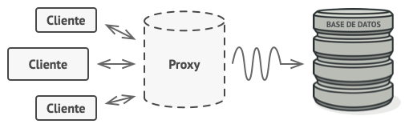

# Patrones estructurales

Los patrones estructurales explican cómo ensamblar objetos y clases en estructuras más grandes, a la vez que se mantiene la flexibilidad y eficiencia de estas estructuras.

## Adapter

### Propósito <a href="#intent" id="intent"></a>

**Adapter** es un patrón de diseño estructural que permite la colaboración entre objetos con interfaces incompatibles.

<figure><figcaption></figcaption></figure>

### Problema <a href="#problem" id="problem"></a>

Imagina que estás creando una aplicación de monitoreo del mercado de valores. La aplicación descarga la información de bolsa desde varias fuentes en formato XML para presentarla al usuario con bonitos gráficos y diagramas.

En cierto momento, decides mejorar la aplicación integrando una inteligente biblioteca de análisis de una tercera persona. Pero hay una trampa: la biblioteca de análisis solo funciona con datos en formato JSON.

<figure><figcaption><p>No puedes utilizar la biblioteca de análisis “tal cual” porque ésta espera los datos en un formato que es incompatible con tu aplicación.</p></figcaption></figure>

Podrías cambiar la biblioteca para que funcione con XML. Sin embargo, esto podría descomponer parte del código existente que depende de la biblioteca. Y, lo que es peor, podrías no tener siquiera acceso al código fuente de la biblioteca, lo que hace imposible esta solución.

### Solución <a href="#solution" id="solution"></a>

Puedes crear un _adaptador_. Se trata de un objeto especial que convierte la interfaz de un objeto, de forma que otro objeto pueda comprenderla.

Un adaptador envuelve uno de los objetos para esconder la complejidad de la conversión que tiene lugar tras bambalinas. El objeto envuelto ni siquiera es consciente de la existencia del adaptador. Por ejemplo, puedes envolver un objeto que opera con metros y kilómetros con un adaptador que convierte todos los datos al sistema anglosajón, es decir, pies y millas.

Los adaptadores no solo convierten datos a varios formatos, sino que también ayudan a objetos con distintas interfaces a colaborar. Funciona así:

1. El adaptador obtiene una interfaz compatible con uno de los objetos existentes.
2. Utilizando esta interfaz, el objeto existente puede invocar con seguridad los métodos del adaptador.
3. Al recibir una llamada, el adaptador pasa la solicitud al segundo objeto, pero en un formato y orden que ese segundo objeto espera.

En ocasiones se puede incluso crear un adaptador de dos direcciones que pueda convertir las llamadas en ambos sentidos.

<figure><figcaption></figcaption></figure>

Regresemos a nuestra aplicación del mercado de valores. Para resolver el dilema de los formatos incompatibles, puedes crear adaptadores de XML a JSON para cada clase de la biblioteca de análisis con la que trabaje tu código directamente. Después ajustas tu código para que se comunique con la biblioteca únicamente a través de estos adaptadores. Cuando un adaptador recibe una llamada, traduce los datos XML entrantes a una estructura JSON y pasa la llamada a los métodos adecuados de un objeto de análisis envuelto.

### Pros y contras <a href="#pros-cons" id="pros-cons"></a>

:heavy\_check\_mark:  _Principio de responsabilidad única_. Puedes separar la interfaz o el código de conversión de datos de la lógica de negocio primaria del programa.

:heavy\_check\_mark:  _Principio de abierto/cerrado_. Puedes introducir nuevos tipos de adaptadores al programa sin descomponer el código cliente existente, siempre y cuando trabajen con los adaptadores a través de la interfaz con el cliente.

:heavy\_multiplication\_x:  La complejidad general del código aumenta, ya que debes introducir un grupo de nuevas interfaces y clases. En ocasiones resulta más sencillo cambiar la clase de servicio de modo que coincida con el resto de tu código.

## Adapter in Java

### Encajar piezas cuadradas en agujeros redondos <a href="#example-0-title" id="example-0-title"></a>

Este sencillo ejemplo muestra el modo en que un Adapter puede hacer que objetos incompatibles trabajen juntos.

```
adapter
├── round 
│   ├── RoundHole.java (Agujeros redondos)
│   └── RoundPeg.java (Piezas redondas)
├── square
│   └── SquarePeg.java (Piezas cuadradas)
├── adapters
│   └── SquarePegAdapter.java (Adaptador de piezas cuadradas para agujeros redondos) 
└── Demo.java (Código cliente)
```

:link: [Adapter in Java](https://github.com/dromero-7854/software-engineering/tree/main/java-design-patterns-examples/src/adapter/example)

## Bridge

### Propósito <a href="#intent" id="intent"></a>

**Bridge** es un patrón de diseño estructural que te permite dividir una clase grande, o un grupo de clases estrechamente relacionadas, en dos jerarquías separadas (abstracción e implementación) que pueden desarrollarse independientemente la una de la otra.

<figure><figcaption></figcaption></figure>

### Problema <a href="#problem" id="problem"></a>

¿_Abstracción?_ ¿_Implementación_? ¿Asusta? Mantengamos la calma y veamos un ejemplo sencillo.

Digamos que tienes una clase geométrica `Forma` con un par de subclases: `Círculo` y `Cuadrado`. Deseas extender esta jerarquía de clase para que incorpore colores, por lo que planeas crear las subclases de forma `Rojo` y `Azul`. Sin embargo, como ya tienes dos subclases, tienes que crear cuatro combinaciones de clase, como `CírculoAzul` y `CuadradoRojo`.

<figure><figcaption><p>El número de combinaciones de clase crece en progresión geométrica.</p></figcaption></figure>

Añadir nuevos tipos de forma y color a la jerarquía hará que ésta crezca exponencialmente. Por ejemplo, para añadir una forma de triángulo deberás introducir dos subclases, una para cada color. Y, después, para añadir un nuevo color habrá que crear tres subclases, una para cada tipo de forma. Cuanto más avancemos, peor será.

### Solución <a href="#solution" id="solution"></a>

Este problema se presenta porque intentamos extender las clases de forma en dos dimensiones independientes: por forma y por color. Es un problema muy habitual en la herencia de clases.

El patrón Bridge intenta resolver este problema pasando de la herencia a la composición del objeto. Esto quiere decir que se extrae una de las dimensiones a una jerarquía de clases separada, de modo que las clases originales referencian un objeto de la nueva jerarquía, en lugar de tener todo su estado y sus funcionalidades dentro de una clase.

<figure><figcaption><p>Puedes evitar la explosión de una jerarquía de clase transformándola en varias jerarquías relacionadas.</p></figcaption></figure>

Con esta solución, podemos extraer el código relacionado con el color y colocarlo dentro de su propia clase, con dos subclases: `Rojo` y `Azul`. La clase `Forma` obtiene entonces un campo de referencia que apunta a uno de los objetos de color. Ahora la forma puede delegar cualquier trabajo relacionado con el color al objeto de color vinculado. Esa referencia actuará como un puente entre las clases `Forma` y `Color`. En adelante, añadir nuevos colores no exigirá cambiar la jerarquía de forma y viceversa.

**Abstracción e implementación**

El libro de la GoF  introduce los términos _Abstracción_ e _Implementación_ como parte de la definición del patrón Bridge. En mi opinión, los términos suenan demasiado académicos y provocan que el patrón parezca más complicado de lo que es en realidad. Una vez leído el sencillo ejemplo con las formas y los colores, vamos a descifrar el significado que esconden las temibles palabras del libro de esta banda de cuatro.

La _Abstracción_ (también llamada _interfaz_) es una capa de control de alto nivel para una entidad. Esta capa no tiene que hacer ningún trabajo real por su cuenta, sino que debe delegar el trabajo a la capa de _implementación_ (también llamada _plataforma_).

Ten en cuenta que no estamos hablando de las _interfaces_ o las _clases abstractas_ de tu lenguaje de programación. Son cosas diferentes.

Cuando hablamos de aplicación reales, la abstracción puede representarse por una interfaz gráfica de usuario (GUI), y la implementación puede ser el código del sistema operativo subyacente (API) a la que la capa GUI llama en respuesta a las interacciones del usuario.

En términos generales, puedes extender esa aplicación en dos direcciones independientes:

* Tener varias GUI diferentes (por ejemplo, personalizadas para clientes regulares o administradores).
* Soportar varias API diferentes (por ejemplo, para poder lanzar la aplicación con Windows, Linux y macOS).

En el peor de los casos, esta aplicación podría asemejarse a un plato gigante de espagueti, en el que cientos de condicionales conectan distintos tipos de GUI con varias API por todo el código.

<figure><figcaption><p>Realizar incluso un cambio sencillo en una base de código monolítica es bastante difícil porque debes comprender <em>todo el asunto</em> muy bien. Es mucho más sencillo realizar cambios en módulos más pequeños y bien definidos.</p></figcaption></figure>

Puedes poner orden en este caos metiendo el código relacionado con combinaciones específicas interfaz-plataforma dentro de clases independientes. Sin embargo, pronto descubrirás que hay _muchas_ de estas clases. La jerarquía de clase crecerá exponencialmente porque añadir una nueva GUI o soportar una API diferente exigirá que se creen más y más clases.

Intentemos resolver este problema con el patrón Bridge, que nos sugiere que dividamos las clases en dos jerarquías:

* Abstracción: la capa GUI de la aplicación.
* Implementación: las API de los sistemas operativos.

<figure><figcaption><p>Una de las formas de estructurar una aplicación multiplataforma.</p></figcaption></figure>

El objeto de la abstracción controla la apariencia de la aplicación, delegando el trabajo real al objeto de la implementación vinculado. Las distintas implementaciones son intercambiables siempre y cuando sigan una interfaz común, permitiendo a la misma GUI funcionar con Windows y Linux.

En consecuencia, puedes cambiar las clases de la GUI sin tocar las clases relacionadas con la API. Además, añadir soporte para otro sistema operativo sólo requiere crear una subclase en la jerarquía de implementación.

### Pros y contras <a href="#pros-cons" id="pros-cons"></a>

:heavy\_check\_mark:  Puedes crear clases y aplicaciones independientes de plataforma.

:heavy\_check\_mark:  El código cliente funciona con abstracciones de alto nivel. No está expuesto a los detalles de la plataforma.

:heavy\_check\_mark:  _Principio de abierto/cerrado_. Puedes introducir nuevas abstracciones e implementaciones independientes entre sí.

:heavy\_check\_mark:  _Principio de responsabilidad única_. Puedes centrarte en la lógica de alto nivel en la abstracción y en detalles de la plataforma en la implementación.

:heavy\_multiplication\_x:  Puede ser que el código se complique si aplicas el patrón a una clase muy cohesionada.

## Bridge in Java

### Bridge (puente) entre dispositivos y controles remotos <a href="#example-0-title" id="example-0-title"></a>

Este ejemplo muestra la separación entre las clases de los remotos y los dispositivos que controlan.

Los remotos actúan como abstracciones, y los dispositivos son sus implementaciones. Gracias a las interfaces comunes, los mismos remotos pueden funcionar con distintos dispositivos y viceversa.

El patrón Bridge permite cambiar o incluso crear nuevas clases sin tocar el código de la jerarquía opuesta.

```
bridge
├── devices 
│   ├── Device.java (Interfaz común de todos los dispositivos)
│   ├── Radio.java
│   └── TV.java
├── remotes
│   ├── Remote.java (Interfaz común de todos los remotos)
│   ├── BasicRemote.java
│   └── AdvancedRemote.java
└── Demo.java (Código cliente)
```

:link: [Bridge in Java](https://github.com/dromero-7854/software-engineering/tree/main/java-design-patterns-examples/src/bridge/example)
